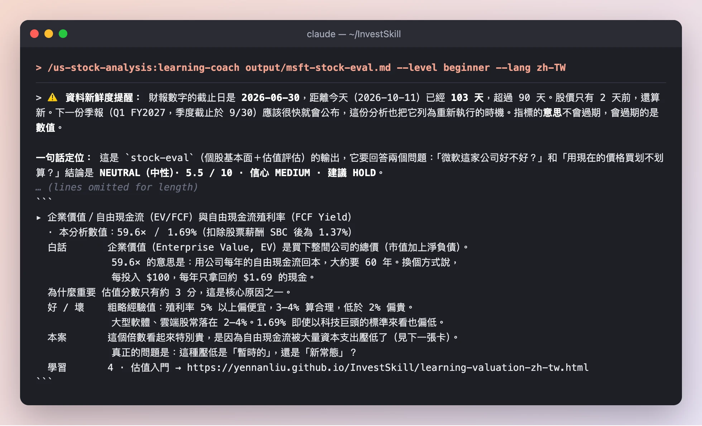
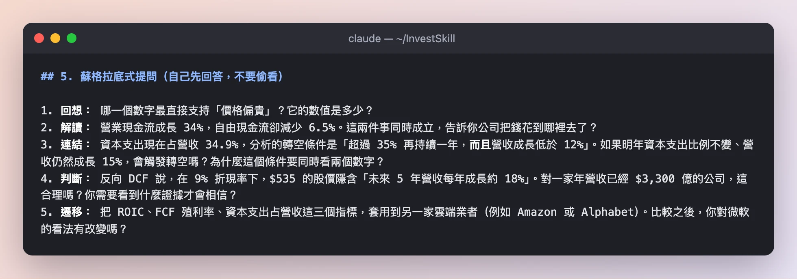

# 實機演練：用四個真實技能分析微軟（MSFT）

這篇演練把 InvestSkill 從頭到尾跑在一檔真實股票上，一次一步。每一步都包含：下了什麼指令、跑出來的截圖、該注意哪些地方，以及帶到下一步的結果。

這裡沒有任何擺拍。每張截圖都是 **2026-10-11** 真實執行結果的節錄，使用的資料是 SEC EDGAR 上微軟 FY2026 10-K 的財報數字，加上 **2026-10-09 那斯達克收盤價 $535.07**。完整、未經修改的輸出放在[頁面最下方](#完整輸出)。

> **僅供教育用途，不構成投資建議。** 這篇的重點是示範*技能怎麼運作*，不是告訴你該怎麼處理 MSFT。數字都有日期，之後會過時。

**快速跳轉：** [0 · 安裝](#步驟-0--安裝) · [1 · 取得資料](#步驟-1--取得第一手資料) · [2 · 評估](#步驟-2--評估這檔股票stock-eval) · [3 · 唱反調](#步驟-3--站在對立面bear-case) · [4 · 驗證數字](#步驟-4--逐一驗證數字fact-check) · [5 · 讀懂它](#步驟-5--讀懂你剛剛看到的東西learning-coach) · [結果](#最後得到了什麼) · [自己試試](#自己跑一次)

> 💡 步驟 2–4 的技能是以英文執行的，所以截圖是英文；步驟 5 的學習教練加上 `--lang zh-TW`，直接輸出繁體中文。每張截圖下方都有中文說明。

---

## 整體計畫

單一技能只給你一個觀點。比較好的習慣是把技能**串起來**：先形成看法，再攻擊它，接著驗證它的數字，最後確定自己真的看懂了。

| 步驟 | 要做什麼 | 技能 | 執行時間 | 結果 |
|------|----------|------|----------|------|
| 1 | 從 SEC 抓微軟的財報數字 | `fetch:fundamentals` 小工具 | 幾秒 | 一份 FY2026 申報數字的資料包 |
| 2 | 這是好公司嗎？價格划算嗎？ | `stock-eval` | 2 分 21 秒 | **NEUTRAL（中性）· 5.5 / 10 · HOLD** |
| 3 | *反對*它的最強論點是什麼？ | `bear-case` | 2 分 8 秒 | 空方強度 **4.9 / 10** → 仍是中性 |
| 4 | 步驟 2 的數字對嗎？ | `fact-check` | 5 分 43 秒 | **9.2 / 10**，找到 1 處標示錯誤 |
| 5 | 這些到底是什麼意思？ | `learning-coach` | 2 分 26 秒 | 指標解說卡＋5 題自我檢測 |

每個技能都是在 Claude Code 中執行，而且只允許讀檔，所以它只能使用資料包裡的內容：不能上網，也不能憑記憶補數字。

---

## 步驟 0 · 安裝

InvestSkill 是一個 Claude Code 外掛。在 Claude Code 裡安裝一次就好：

```bash
/plugin marketplace add yennanliu/InvestSkill
/plugin install us-stock-analysis@invest-skill
```

接著確認它已經啟用：


*`us-stock-analysis` 1.12.0 版已安裝並啟用。全部 34 個技能都可以用 `/us-stock-analysis:<技能名>` 來呼叫。*

**結果：** 技能準備就緒。沒有用 Claude Code？Cursor、Gemini CLI、Copilot 和 ChatGPT 的用法請看[自己跑一次](#自己跑一次)。

---

## 步驟 1 · 取得第一手資料

分析的品質取決於數字的品質。如果你什麼資料都不給就問 AI 一檔股票，它可能會用記憶補空缺，而記憶會過時。所以在跑任何技能之前，我們先把事實交給它。

這個專案附了一個小工具，會從 SEC 免費的 XBRL API 下載公司**自己申報**的數字，寫成一份「資料包」：


*小工具找到微軟會計年度截至 2026-06-30 的 10-K，寫出 `data/fixtures/MSFT.md`。SEC 沒有股價資料，所以我們手動在 `price:` 那一行填上最新收盤價。*

**注意這幾點**

- **每個數字都是公司自己申報的。** 營收 $3,318 億、淨利 $1,337 億、自由現金流 $670 億，全部是微軟在財報中標記的數字，不是任何人的估計。
- **小工具會告訴你缺了什麼。** 折舊攤銷（`dep_amort`）沒有被標記，所以後面的技能必須寫「無法取得」，而不是用猜的。
- **SEC 要求留下聯絡方式。** 依照 SEC 的公平存取政策，請把 `EDGAR_USER_AGENT` 設成你的名字和 email。

**結果：** 一個純文字檔，包含 FY2026 和 FY2025 的損益表、資產負債表、現金流量表，以及股價。下面每個技能都只讀這個檔案。

---

## 步驟 2 · 評估這檔股票（`stock-eval`）

`stock-eval` 是最全面的起點。它會看財務體質、估值、企業品質和風險，最後給出一個訊號。

```text
/us-stock-analysis:stock-eval MSFT — use only the data pack at data/fixtures/MSFT.md
```

### 2a · 先交代資料來源，再檢查資料


*在給出任何看法之前，技能先說明每個數字從哪裡來、可以信幾分。接著它重新計算衍生數字（FCF、淨負債、利潤率、EPS），確認資料包的數字兜得起來。*

**注意這幾點**

- **`Data & Sources` 標頭**寫著：申報數字的信心是 HIGH，但估值只有 MEDIUM，因為折現率的輸入是模型自己的假設。InvestSkill 的每份輸出都以這個標頭開頭。
- **它會說自己做不到什麼。** 沒有 beta、沒有同業倍數、沒有分析師預估，所以沒有預估本益比，也沒有 EV/EBITDA。它寫「無法取得」，而不是自己編。
- **它找到三件值得細看的事：** 一行太小的 SG&A（銷售與行銷費用另外標記）、一筆把淨利成長墊高的 **$107 億業外收益**，以及沒有算進負債的租賃。
- **一段話的投資論點：** 公司非常優秀（營收成長 17.8%、營業利益率 46.8%），但 AI 資本支出暴增 80% 到 $1,159 億，所以自由現金流反而*減少* 6.5%。

### 2b · 估值：它值多少錢？


*現金流折現（DCF）模型。技能把每個輸入都標成自己的假設，附上敏感度表，還把模型倒過來跑，看看現在的股價隱含了什麼。*

**注意這幾點**

- **基準情境約每股 $453**，股價是 $535。安全邊際 ＝（價值 − 股價）÷ 價值 ＝（453 − 535）÷ 453 ≈ **−18%**：你付的錢比估值還多。
- **敏感度表才是誠實的部分。** 折現率只要動一個百分點，估值就在 $379 到 $558 之間擺動。DCF 給的是一個區間，不是一個數字。
- **反向 DCF** 問的是更有用的問題：要怎樣 $535 才合理？答案是**未來五年營收每年成長約 18%**，和微軟剛做到的 17.8% 差不多。

### 2c · 結論


*每次 InvestSkill 執行都以同樣的方框「投資訊號」收尾，所以不同技能的結果可以並排比較。*

**步驟 2 的結果：** **NEUTRAL（中性）· 信心 MEDIUM · 5.5 / 10 · HOLD。** 品質約 8 分、估值約 3 分，相抵之後是中性：*一家很棒的公司，但現在的價格已經假設 AI 投資會成功。* 技能也列出了會翻轉結論的條件，例如自由現金流利潤率回到 25% 以上（轉多），或 ROIC 跌破 22%（轉空）。

---

## 步驟 3 · 站在對立面（`bear-case`）

單一份分析很容易自己同意自己。`bear-case` 是刻意安排的紅隊：它會盡全力建立**不該持有**這檔股票的最強論點。

```text
/us-stock-analysis:bear-case MSFT — use only the data pack at data/fixtures/MSFT.md
```

### 3a · 空方論點與評分


*空方論點用六個支柱評分，你可以看到哪些論點有力、哪些薄弱。*

**注意這幾點**

- **它比步驟 2 挖得更深。** 它把 EPS 成長拆成申報的 31.6% 和扣除 $156 億業外收益變動後的**本業約 18%**，還算出新投入資本的**增量 ROIC** 只有約 17%，而平均資本的 ROIC 約 36%。
- **它承認自己哪裡弱。** 「競爭威脅」支柱只拿 0.7 / 2，因為資料包裡沒有部門或同業資料。好的空方報告會告訴你哪些論點只是推測。
- **強度 4.9 / 10 ＝「中等」：** 有真實的警訊，但不足以推翻投資論點。

### 3b · 最多可能跌多少？


*附上明確機率的下檔目標價，也包含「空方看錯」的情境。*

**注意這幾點**

- **機率加權價值約 $513，只比股價低約 4%。** 連空方都認為這是*不加碼*的理由，而不是放空的理由。
- **它會反駁自己。** 結尾列出「論點殺手」（什麼情況會證明空方錯了），並承認最強的多方論點：營業利益率其實是*擴張*的。

**步驟 3 的結果：** **NEUTRAL · 5.1 / 10 · HOLD（信念弱）。** 兩個任務完全相反的技能，結論落在同一個地方。這種一致比任何單一結果都更有說服力。

---

## 步驟 4 · 逐一驗證數字（`fact-check`）

AI 模型可能算錯。`fact-check` 會把一份完成的報告裡每個數字和論述都抽出來，逐一對照第一手來源。

我們把步驟 2 的輸出存成 `output/msft-stock-eval.md`，然後執行：

```text
/us-stock-analysis:fact-check output/msft-stock-eval.md — verify every figure against data/fixtures/MSFT.md
```

### 4a · 成績單


*抽出 95 項論述，其中 80 項從原始數字重新計算，全部吻合。它甚至重建了整個 DCF，九格敏感度表都對到 $0.50 以內。*

### 4b · 而且它真的抓到東西了


*唯一的不一致：報告把 FY26 用「平均資產」算的資產周轉率，拿去和 FY25 用「年底資產」算的比較，結果一個下降的數字看起來像在上升。*

**注意這幾點**

- **抓到的問題是真的，而且很細微。** 沒有任何數字算錯，但有兩個數字的計算基礎不同。它不影響訊號，fact-check 也明確說了這一點。
- **「無法驗證」不等於「錯誤」。** 有三項論述（例如「SG&A 的缺口幾乎可以確定是銷售與行銷費用」）是合理推論，但資料包無法證明，所以它們被標上 `[?]`，而不是被打叉。
- **正確解讀分數。** 這個技能訊號框裡的 9.2 是*驗證*分數，代表報告的數字有多可信，不是看多的評等。訊號本身（NEUTRAL / HOLD）是從原報告照抄的。

**步驟 4 的結果：** **驗證分數 9.2 / 10。** 支撐中性結論的數字站得住腳，只需要修正一個標示。

---

## 步驟 5 · 讀懂你剛剛看到的東西（`learning-coach`）

到這裡已經有三份報告，滿滿的 ROIC、EV/FCF、DCF。`learning-coach` 會像導師一樣解說一份輸出：每個指標的白話意思、為什麼重要、怎樣算好，再出幾題讓你自我檢測。加上 `--lang zh-TW` 就會直接用繁體中文解說。

```text
/us-stock-analysis:learning-coach output/msft-stock-eval.md --level beginner --lang zh-TW
```

### 5a · 每個指標一張卡



*每個影響結論的指標都有一張卡：白話解釋、為什麼重要、好壞區間、本案數值，以及對應的學習課程。*

### 5b · 接著讓你自己想



*五個問題，從回想一路爬到判斷，最後一題要你把同樣的概念套用到另一家公司。*

**注意這幾點**

- **「用公司每年的自由現金流回本，大約要 60 年」**：這就是 EV/FCF 59.6 倍，一句話說完，沒有術語。
- **它會提醒資料的日期。** 財報數字已經是 103 天前的，超過 90 天的新鮮度門檻，所以它提醒你下一份季報出來後要重跑。
- **它增加的是理解，不是新結論。** 訊號框是從 `stock-eval` 原封不動抄過來的。
- **它也會出錯，所以要驗證。** 在「這些數字怎麼串起來」那一段，教練把資本支出寫成「800 億美元級」，但資料包裡的數字是 $1,159 億。這正是步驟 4 存在的理由：再好的解說，數字也要回頭對照原始資料。

**步驟 5 的結果：** 你能說明*為什麼*結論是中性，也知道接下來該盯哪些數字。

---

## 最後得到了什麼

| 技能 | 訊號 | 分數 | 一句話重點 |
|------|------|------|------------|
| `stock-eval` | NEUTRAL · HOLD | 5.5 / 10 | 頂級的公司，但價格已經假設 AI 資本支出會有回報 |
| `bear-case` | NEUTRAL · HOLD | 5.1 / 10（空方強度 4.9） | 自由現金流和盈餘品質確實有疑慮，但不值得放空 |
| `fact-check` | （照抄）NEUTRAL · HOLD | 驗證分數 9.2 / 10 | 數字站得住，只有一處基礎不一致的比較 |
| `learning-coach` | （照抄）NEUTRAL · HOLD | — | 盯住 FCF 利潤率、ROIC、資本支出占營收比 |

**這次實跑告訴我們，用 AI 做股票研究的五件事**

1. **先給資料。** 有了 SEC 資料包，每個技能都能說清楚數字從哪裡來；資料包沒有的，就寫「無法取得」而不是用猜的。
2. **一個技能只是一個觀點。** `stock-eval` 和 `bear-case` 的任務相反，結論卻一致，所以中性的判斷更有說服力。
3. **一定要驗算。** `fact-check` 重算了 80 個數字，還是找到一個人工閱讀很可能會漏掉的不一致。
4. **每個結論都附上自己的失效條件。** 每份輸出都列出會翻轉結論的觸發條件，所以你知道該盯什麼，不用重讀整份報告。
5. **先讀懂，再行動。** `learning-coach` 把報告變成你能說明的東西，也會問你應該答得出來的問題。

---

## 自己跑一次

**Claude Code**：完成步驟 0 之後，在專案目錄中：

```bash
# 1. 從 SEC 產生資料包（不需要 API key）
export EDGAR_USER_AGENT="Your Name you@example.com"
npm run fetch:fundamentals -- MSFT
# 接著在 data/fixtures/MSFT.md 的 `price:` 那一行填上今天的股價

# 2–5. 在 Claude Code 裡
/us-stock-analysis:stock-eval MSFT — use only the data pack at data/fixtures/MSFT.md
/us-stock-analysis:bear-case MSFT — use only the data pack at data/fixtures/MSFT.md
/us-stock-analysis:fact-check output/msft-stock-eval.md — verify every figure against data/fixtures/MSFT.md
/us-stock-analysis:learning-coach output/msft-stock-eval.md --level beginner --lang zh-TW
```

想完全重現這篇的條件（技能可以讀檔但不能上網），可以用無介面模式執行：`claude -p "<指令>" --allowedTools Read`。

**Cursor、Gemini CLI、GitHub Copilot、ChatGPT**：每個技能在 [`prompts/`](https://github.com/yennanliu/InvestSkill/tree/main/prompts) 裡都有一份純文字提示詞版本。先貼上 `prompts/stock-eval.md`，再貼上資料包，然後說「只用這份資料評估 MSFT，用繁體中文回答」。也可以用[安裝腳本](cookbook-zh-tw.html)一行裝到你的 AI 工具上。

**下一步：** [選擇技能](choose-a-skill-zh-tw.html)把 30 個框架對應到不同目標，[操作手冊](cookbook-zh-tw.html)有更多範例。

---

## 完整輸出

以下是上面每次執行的完整、未經修改的輸出，讓你確認截圖沒有刻意挑選。步驟 2–4 是英文原文，步驟 5 是繁體中文。

<details>
<summary><strong>步驟 2 — <code>stock-eval</code> 完整輸出（英文）</strong></summary>

~~~~text
# MSFT — Stock Evaluation (data pack only)

```
Data & Sources
  As of:      2026-06-30 (FY2026 year end) · shares as of 2026-07-23 · price as of 2026-10-09 close
  Source:     SEC EDGAR 10-K FY2026 (accession 0001193125-26-323660) via XBRL companyfacts;
              FY2025 column from the prior 10-K; price = NASDAQ close $535.07 (in pack)
  Retrieval:  pasted by user (data/fixtures/MSFT.md, generated by scripts/fetch-fundamentals.js)
  Confidence: HIGH for reported figures · MEDIUM for derived valuation (DCF inputs are my assumptions)
```

**Scope.** I used only the pack and did no browsing. The pack doesn't contain the following, so they're **unavailable**: beta, risk-free rate, peer and sector multiples, 5-year history (so no 3- or 5-year CAGR), forward estimates, analyst consensus, guidance history, insider ownership and compensation, D&A (so no EBITDA or EV/EBITDA), current assets and liabilities (so no current or quick ratio), segment mix, and technical levels.

---

## 1. Investment Thesis Summary

Microsoft's FY2026 operating results were very strong. Revenue grew **17.8%**, operating margin rose to **46.8%**, and ROIC was about **27%**. The problem is the AI build-out: capex rose **80%** to $115.9B, so **free cash flow fell 6.5%** even though operating cash flow grew 34%. At $535 the stock trades at **~60× EV/FCF (a 1.7% FCF yield)**, and my base DCF puts fair value at about **$453**. The business is excellent, but the price already assumes the capex will pay off.

## 2. Pack integrity check (I recomputed every derived line)

| Check | Pack | Recomputed | Status |
|---|---|---|---|
| Revenue growth | — | 331,839 / 281,724 − 1 = **17.8%** | ✅ |
| Gross margin | 67.9% | 225,465 / 331,839 = **67.9%** (FY25 68.8%) | ✅ |
| FCF = OCF − capex | 66,987 | 182,935 − 115,948 = **66,987** | ✅ |
| Net debt = debt − cash | 19,359 | 40,294 − 20,935 = **19,359** | ✅ |
| FCF payout (dividends ÷ FCF) | — | 26,445 / 66,987 = **39.5%** | ✅ |
| Assets = liabilities + equity | — | 315,989 + 442,387 = 758,376 | ✅ |
| EPS | 17.95 | 133,749 / 7,453 = 17.95 | ✅ |

Three things in the pack need care:

- **The "SG&A" line ($7,956M) is too small to be all of SG&A.** Gross profit − R&D − SG&A = $181,947M, but reported operating income is $155,237M. The **$26,710M gap** is almost certainly sales & marketing, which isn't tagged in the pack. The same pattern holds for FY25, where the gap is $25,654M.
- **There is a large non-operating gain.** Pre-tax income ($165,934M) is **$10.7B above** operating income. In FY25 it was $4.9B *below*. The pack doesn't say what the gain is. It is the main reason net income grew 31% while operating income grew 21%.
- **Leases are left out of debt.** The PP&E roll-forward (204,966 + 115,948 capex → 313,076) doesn't reconcile with capex alone. That suggests large lease-financed additions, and those leases are not in the $40.3B "total debt" figure.

## 3. Financial Health

| Metric | FY2026 | FY2025 | Δ |
|---|---|---|---|
| Revenue ($M) | 331,839 | 281,724 | +17.8% |
| Operating income | 155,237 | 128,528 | +20.8% |
| Net income | 133,749 | 101,832 | +31.3% |
| Gross / operating / net margin | 67.9% / 46.8% / 40.3% | 68.8% / 45.6% / 36.1% | −0.9 / +1.2 / +4.2 pp |
| Operating cash flow | 182,935 | 136,162 | +34.4% |
| Capex | 115,948 (34.9% of revenue) | 64,551 (22.9%) | **+79.6%** |
| **FCF** | **66,987** (20.2% margin) | **71,611** (25.4%) | **−6.5%** |
| SBC | 12,405 | 11,974 | +3.6% |
| Cash + short-term investments | 76,843 | 94,565 | −18.7% |
| Total debt (excluding leases) | 40,294 | 43,151 | −6.6% |
| Net debt (cash only) / net cash incl. STI | 19,359 / **(36,549) net cash** | 12,909 / (51,414) | |

**Operating leverage is positive.**
- For every extra dollar of revenue, 53.3% became extra operating income (+$26.7B on +$50.1B).
- The degree of operating leverage was 1.17×.
- Total opex grew 7.4% against 17.8% revenue growth.
- **Gross margin fell, though.** Cost of revenue grew 21.1%, which looks like infrastructure cost coming through.

**Working capital** (FY26 vs FY25):

| Metric | FY2026 | FY2025 |
|---|---|---|
| DSO | 89.0 days | 90.6 days |
| DIO | 4.8 days | 3.9 days |
| DPO | 145.5 days | 115.2 days |
| CCC | **−51.7 days** | −20.7 days |

The jump in DPO is probably capex-related payables, so the improvement in CCC overstates operating efficiency.

## 4. Valuation Metrics (price $535.07; market cap ≈ **$3.97T** on 7,426M shares; EV ≈ **$3.99T**)

| Metric | Current | 1-Yr Ago / 5-Yr Avg / Sector |
|---|---|---|
| P/E (TTM = FY26) | **29.8×** | Unavailable |
| P/E, excluding the non-operating gain* | **~31.9×** (normalized EPS ≈ $16.79) | Unavailable |
| P/E (forward), PEG | Unavailable (no estimates). Trailing EPS growth gives 0.94× reported, ~1.7× normalized | — |
| Price/Book | 9.0× | Unavailable |
| Price/Sales | 12.0× | Unavailable |
| EV/EBIT | 25.7× | Unavailable |
| EV/EBITDA | **Unavailable** (D&A not tagged) | — |
| EV/FCF | **59.6×** (FCF yield 1.69%; 1.37% after SBC) | Unavailable |
| Dividend yield (cash paid ÷ market cap) | ~0.67% | Unavailable |
| Payout ratio | 19.8% of net income · 39.5% of FCF · **72.7% including buybacks** | — |

\*Normalized EPS = operating income × (1 − 19.4% effective tax rate) ÷ 7,453M diluted shares.

## 5. Key Ratios and DuPont

| Ratio | Current | Assessment |
|---|---|---|
| ROE (average equity) | 34.0% | Excellent, driven by margin rather than leverage |
| ROA (average assets) | 19.4% | Excellent |
| ROIC (NOPAT ÷ (equity + debt − cash)) | **27.1%** (FY25 29.7%) | Very high, but falling as invested capital balloons |
| Debt/Equity | 0.09× | Very low (excluding leases) |
| Interest coverage (EBIT ÷ interest expense) | 50.9× | No concern |
| Asset turnover | 0.48× (FY25 0.46×, ending basis 0.44 vs 0.46) | Falling as PP&E grows 53% |
| Current / quick ratio | **Unavailable** | — |

**3-factor DuPont:** 40.3% net margin × 0.482 asset turnover × 1.75 equity multiplier = **34.0% ROE**. ROE comes from margin, which is the most durable driver.

**5-factor DuPont:** tax burden 0.806 × interest burden **1.069** × EBIT margin 0.468 × turnover 0.482 × multiplier 1.75. An interest burden above 1.0 means the non-operating gain is *adding* to ROE this year.

## 6. Quality Score

**Piotroski F-Score: 6 of 8 testable criteria (6–7/9; criterion 6 can't be tested).**

| # | Criterion | Result | Score |
|---|---|---|---|
| 1 | ROA > 0 | 17.6% | 1 |
| 2 | CFO > 0 | $182.9B | 1 |
| 3 | ΔROA | 17.6% vs 16.5% | 1 |
| 4 | CFO/TA > ROA | 24.1% > 17.6% | 1 |
| 5 | Long-term debt / assets falling | 4.1% vs 6.5% | 1 |
| 6 | Current ratio improving | Unavailable | — |
| 7 | No dilution | Diluted shares 7,453M vs 7,465M | 1 |
| 8 | Gross margin up | 67.9% vs 68.8% | 0 |
| 9 | Asset turnover up | 0.438 vs 0.455 | 0 |

**Earnings quality is high on accruals, weaker on FCF conversion.**
- Accruals ratio is **−7.1%**.
- Cash conversion (OCF ÷ net income) is **1.37×**.
- FCF ÷ net income is only **0.50×**.
- About $10.7B of pre-tax income is non-operating and unexplained in the pack, so treat reported EPS growth of 31.6% as overstating the underlying ~18%.

**ROIC vs WACC:** WACC can't be computed from the pack (beta and risk-free rate are unavailable). Even so, ROIC of 27% exceeds any plausible large-cap WACC (8–10%, my assumption) by more than 1,700bp, so **value creation is clear.** The trend is down, from 29.7% to 27.1%.

## 7. DCF (assumptions are mine, not data)

**Base case:**
- Revenue grows 14% a year for years 1–5, fading to 8% by year 10.
- FCF margin recovers from 20.2% to 28% by year 5 and 30% by year 10 as capex intensity normalizes.
- WACC 9%, terminal growth 3%.
- Net debt $19.4B; 7,453M diluted shares.

Result: **EV ≈ $3.40T, about $453/share.** The terminal value is 67% of EV.

**Sensitivity ($/share)**

| WACC \ g | 2.5% | 3.0% | 3.5% |
|---|---|---|---|
| 8% | 520 | 558 | 605 |
| 9% | 428 | **453** | 483 |
| 10% | 362 | 379 | 399 |

**Reverse DCF.** On the base cash-flow path, $535 implies a discount rate of about **8.2%**. At a 9% WACC it instead requires roughly **18% a year revenue growth for five years**, or FCF margins in the mid-30s.

**Margin of safety: −18%.** The price is about 18% above base-case value, so there is no margin of safety.

## 8. Management, Consensus, Guidance

- **Capital allocation.**
  - Returned $48.7B (dividends $26.4B + buybacks $22.3B), which is 73% of FCF.
  - The diluted share count fell 0.2%, so buybacks are mostly offsetting SBC ($12.4B).
  - The very large capex commitment is the defining allocation decision. Its return is not yet visible: ROIC is falling and asset turnover is falling.
- **Guidance accuracy, insider ownership, compensation, say-on-pay:** unavailable.
- **Analyst ratings, price targets, estimate revisions, revision momentum (ERM):** unavailable.

## 9. Key Risks

1. **The capex payoff may not arrive.** Capex is 35% of revenue. If AI demand doesn't fill the $108B of new PP&E, ROIC keeps falling, FCF stays near $67B, and a 60× FCF multiple has room to compress.
2. **Gross margin erosion.** Cost of revenue is growing faster than revenue. Once D&A from FY26's capex fully hits the P&L, operating margin could reverse.
3. **Earnings quality and hidden obligations.** A $10.7B swing in non-operating income flatters EPS, and leases are excluded from the debt figure. True leverage and normalized earnings are both worse than the headline numbers.

**Risk matrix in brief:**
- Financial risk is **LOW**: net debt is 0.12× EBIT, and there is net cash including short-term investments.
- Valuation risk is **HIGH**: a 10% EPS miss at a constant 30× multiple is about −$54/share, and a re-rate to 25× is about −16%.
- Interest-rate sensitivity is high because of long duration: the terminal value is 67% of EV.
- Regulatory and antitrust exposure is unassessable from the pack.

## 10. Price Targets and Entry Zone

| Case | Value | Probability |
|---|---|---|
| Bull (8% WACC, 3.5% g) | ~$605 | 25% |
| Base (9% WACC, 3% g) | ~$453 | 50% |
| Bear (10% WACC, 2.5% g) | ~$362 | 25% |
| **Probability-weighted** | **~$468** (−12.5% vs $535) | |

**Entry zone: about $410–455.** That's base value down to a 10% margin of safety. No technical support levels are in the pack.

## Thesis Invalidation

The signal is NEUTRAL, so this lists what would push it either way.

**Turns BULLISH if:**
- FCF margin recovers to ≥25% (FCF ≥ ~$85B) with revenue growth still ≥15%, which would show capex intensity normalizing.
- Price falls to ≤$455 (the base DCF value) with ROIC holding ≥25%.

**Turns BEARISH if:**
- Capex ÷ revenue stays above 35% for another year while revenue growth slows below 12%.
- Gross margin falls below 65%, or ROIC falls below 22%.
- The FY26 non-operating gain proves non-recurring and FY27 EPS growth falls below 10%.

**Re-run this analysis when:**
- [ ] Next earnings release (Q1 FY2027)
- [ ] Price moves ±15% from $535 (≤$455 or ≥$615)
- [ ] 60 days have elapsed
- [ ] Material news event (acquisition, leadership change, regulatory decision)
- [ ] Next 10-K or a refreshed pack: regenerate `data/fixtures/MSFT.md`

```
╔══════════════════════════════════════════════╗
║              INVESTMENT SIGNAL               ║
╠══════════════════════════════════════════════╣
║ Signal:      NEUTRAL                         ║
║ Confidence:  MEDIUM                          ║
║ Horizon:     LONG-TERM                       ║
║ Score:       5.5 / 10                        ║
╠══════════════════════════════════════════════╣
║ Action:      HOLD                            ║
║ Conviction:  MODERATE                        ║
╚══════════════════════════════════════════════╝
```

Score Guide: 8.0–10.0 Strongly Bullish | 6.0–7.9 Moderately Bullish | 4.0–5.9 Neutral | 2.0–3.9 Moderately Bearish | 0.0–1.9 Strongly Bearish
Confidence: HIGH (strong data, clear signals) | MEDIUM (mixed signals) | LOW (limited data, conflicting signals)
Horizon: SHORT-TERM (1 week–3 months) | MEDIUM-TERM (3 months–1 year) | LONG-TERM (1+ years)

On mapping: quality scores near 8 (ROIC 27%, 47% operating margin, net cash) and valuation scores near 3 (60× FCF, 18% above base DCF), which nets to NEUTRAL. Confidence is MEDIUM rather than HIGH because the reported figures are primary-source, but WACC inputs, consensus and peer data are unavailable, and the DCF rests on my assumptions.

**Disclaimer:** Educational analysis only. Not financial advice.
~~~~

</details>

<details>
<summary><strong>步驟 3 — <code>bear-case</code> 完整輸出（英文）</strong></summary>

~~~~text
# MSFT: Bear Case

> ⚠️ **This is a deliberately one-sided bear case. Pair it with `/stock-eval` (or a bull-case analysis) for a balanced view.**

```
Data & Sources
  As of:      Fundamentals 2026-06-30 (FY2026 fiscal year end) · shares 2026-07-23 · price 2026-10-09 close ($535.07)
  Source:     SEC EDGAR 10-K FY2026 (accession 0001193125-26-323660), XBRL companyfacts; FY2025 from prior 10-K · price as stated in the pack (NASDAQ close)
  Retrieval:  pasted by user (data/fixtures/MSFT.md, generated 2026-10-10)
  Confidence: HIGH for reported figures · MEDIUM overall (no history, peer, segment, D&A, lease or consensus data in the pack)
```

**Not in the pack, so not used here:** five-year multiple history, peer multiples, segment revenue (Azure, Office, etc.), D&A, finance-lease obligations, the breakdown of non-operating income, consensus estimates, the next earnings date, insider activity and short interest. Wherever one of these would matter, I say it is unavailable.

---

## Bear thesis in three sentences

Microsoft spent **$115.9B on capex in FY2026, up 80%.** Free cash flow **fell 6.5%** while revenue grew 17.8%, so the cash-generating business that justified the premium is turning into a capital-intensive infrastructure business. Headline EPS grew 31.6%, but about **$15.6B of that came from a swing in non-operating income**. Core operating EPS grew about 18%, so the stock trades at about **32x core earnings and 59x FCF**. At $535, the price needs roughly 18% compound FCF growth for a decade. The depreciation from the PP&E build is still to come, and the pack does not give D&A, which hides the most important cost line.

---

## Bear Case Strength Score

```
Pillar                              Weight   Score
Valuation stretch                    0–2      1.4
Deteriorating fundamentals           0–2      1.1
Accounting / earnings-quality flags  0–2      0.8
Competitive & secular threats        0–2      0.7
Management & capital allocation      0–1      0.5
Catalyst clarity & timing            0–1      0.4
                          BEAR CASE STRENGTH:  4.9 / 10
```
**Moderate:** there are real red flags, and reducing or hedging the position is worth considering. The case is not thesis-breaking, and I was unable to evidence the competitive pillar from this pack.

---

## Detailed findings

### 1. Valuation stretch: severity HIGH (1.4/2)

| Metric (price $535.07, 7,426M shares) | Value |
|---|---|
| Market cap | **$3.97T** ($3,973,430M) |
| EV (mkt cap + pack net debt $19,359M) | $3.99T |
| P/E (reported diluted EPS $17.95) | **29.8x** |
| P/E on core EPS (ex non-operating, ~$16.79) | **~31.9x** |
| P/S / EV/Sales | 12.0x / 12.0x |
| EV/EBIT | 25.7x |
| P/FCF (FCF $66,987M) | **59.3x** (FCF yield 1.69%) |
| P/(FCF − SBC) | 72.8x |
| P/B (book $59.57/share) | 9.0x |
| Dividend yield / buyback yield | 0.67% / 0.56% |

- **History and peers:** unavailable. The pack has no five-year range or peer set, so I can't say how many turns MSFT trades above its own history.
- **Reverse DCF** (my assumptions: 9% discount rate, 20x terminal FCF multiple, 10-year horizon). Today's $3.97T needs **FCF to compound at about 18% a year for 10 years** from the FY2026 base of $67.0B. At 15% the result is about $3.20T, roughly 20% below the current price. That growth rate matches this year's revenue growth, and it has to hold while capex already takes 63% of operating cash flow.
- **PEG:** about 1.7x on core EPS growth of ~18.4% (31.9 ÷ 18.4). That's not extreme. The weak point is the 59x FCF multiple, not the P/E.

### 2. Deteriorating fundamentals: severity MEDIUM (1.1/2)

| | FY2026 | FY2025 | Change |
|---|---|---|---|
| Revenue | $331,839M | $281,724M | **+17.8%** |
| Cost of revenue | $106,374M | $87,831M | **+21.1%** |
| Gross margin | 67.9% | 68.8% | **−0.9 pt** |
| Operating margin | 46.8% | 45.6% | +1.2 pt |
| Capex | $115,948M | $64,551M | **+79.6%** |
| Capex / revenue | 34.9% | 22.9% | +12.0 pt |
| Capex / OCF | 63.4% | 47.4% | +16.0 pt |
| Free cash flow | $66,987M | $71,611M | **−6.5%** |
| FCF margin | 20.2% | 25.4% | −5.2 pt |
| FCF / net income | 50.1% | 70.3% | −20 pt |
| Revenue / net PP&E | 1.06x | 1.37x | asset-heavier |

- **Gross margin is falling.** Cost of revenue grew faster than revenue. Operating margin rose only because R&D (+9.5%) and SG&A (+10.1%) grew at about half the rate of revenue. That kind of operating leverage runs out.
- **Depreciation is still ahead.** This is a hypothesis, because D&A is not tagged in the pack. Net PP&E jumped 53%, from $205.0B to $313.1B. Assets put into service in FY2026 will depreciate through cost of revenue in FY2027–FY2030, so gross-margin pressure is more likely to grow than to fade.
- **Returns on incremental capital are falling.** NOPAT (19.4% tax rate) rose about $19.3B on about $113.8B of new invested capital (equity + debt − cash − short-term investments). That's an **incremental ROIC of ~17%**, against ~36% on average capital. It is probably still above WACC, but WACC is not in the pack. The trend is the bear point.
- **Liquidity has thinned.** Cash plus short-term investments fell from $94.6B to $76.8B. The current portion of debt tripled, from $3.0B to $9.2B.

### 3. Accounting and earnings quality: severity LOW-MEDIUM (0.8/2)

- **Non-operating income inflated EPS growth.** Pre-tax income ($165,934M) exceeded operating income ($155,237M) by **+$10.7B** in FY2026. In FY2025 it fell short by **−$4.9B**. That **$15.6B swing is ~37% of the pre-tax income increase**. Without it, EPS is about **$16.79**, and core growth is **~18%, not the reported 31.6%**. The pack doesn't break down what drove it (investment gains, equity-method results, FX), so I can't tell whether it will recur. The tax rate also rose, from 17.6% to 19.4%.
- **Payables stretched.** Accounts payable rose 53% (+$14.7B), equal to **~31% of the $46.8B increase in operating cash flow**. If part of that is capex-related payables, cash capex understates the economic build. The breakdown is unavailable.
- **About $33B of cash outflows are not itemized.** OCF − capex − dividends − buybacks = +$18.3B. Total debt fell $2.9B, so cash plus short-term investments should have risen by about $15.4B. Instead they fell by $17.7B. The pack doesn't show where the difference went (acquisitions, investments, lease principal, tax withholding on SBC).
- **Leases are left out of debt.** The pack's $40.3B total debt excludes leases unless they are tagged as debt. For a company building datacenters, lease obligations could be material. The figure is unavailable.
- **Buybacks mostly offset SBC.** $22.3B of repurchases cut diluted shares by only 0.16% (7,465M to 7,453M). SBC was $12.4B, about 18.5% of FCF.
- **Not red flags (concessions):** DSO *improved*, from 90.6 to 89.0 days. Inventory is immaterial at 4.8 days. The pack shows no restatements or auditor issues.

### 4. Competitive and secular threats: severity LOW-MEDIUM, under-evidenced (0.7/2)

The pack has no segment, customer or peer data, so this pillar rests mostly on hypothesis:
- **Hypothesis: an AI infrastructure arms race.** The capex surge suggests rivals are forcing a spending pace Microsoft can't skip. If AI compute pricing commoditizes, the $313B asset base earns utility-like returns. The falling gross margin and incremental ROIC fit this story but don't prove it.
- Regulatory and antitrust exposure, customer concentration and AI-partner economics are **unavailable from the pack**.

### 5. Management and capital allocation: severity MEDIUM (0.5/1)

- Management chose to nearly double capex in one year at a cost to FCF. The bet may pay off, but **shareholders are bearing build risk at a 1.7% FCF yield**.
- Dividends plus buybacks ($48.7B) took **72.7% of FCF**. FCF payout on dividends alone is 39.5%. Cash returns to shareholders now compete with capex, and liquid assets are falling.
- Insider activity and governance are unavailable from the pack.

### 6. Downside catalysts and timeline (0.4/1)

| Window | Trigger | Likely magnitude |
|---|---|---|
| Near-term (0–3 mo) | Q1 FY2027 report. The quarter ended 2026-09-30, so the report is probably near; the exact date is not in the pack. A gross-margin step-down from depreciation, or capex guided up again | −5% to −10% |
| 6–18 mo | FY2027 FCF falls again despite double-digit revenue growth; non-operating gains don't repeat | De-rating toward 22–25x core EPS |
| Structural | AI compute pricing commoditizes, so incremental ROIC converges toward WACC | Multiple re-bases toward 18–20x |

Catalyst clarity is weak because there are no event dates or consensus figures to measure a "miss" against.

---

## Downside target and risk/reward

*(The EPS paths and multiples below are my assumptions; the EPS bases come from the pack.)*

| Scenario | EPS basis | Multiple | Price | vs. $535.07 | Probability |
|---|---|---|---|---|---|
| **Base-bear** | Core $16.79 × 1.12 = $18.80 (FY27; depreciation slows growth) | 22x | **$414** | **−22.6%** | 35% |
| **Severe-bear** | Core EPS flat at $16.79 (margin squeeze + AI price war) | 18x | **$302** | **−43.5%** | 15% |
| Bull / status quo (thesis wrong) | $17.95 × 1.20 = $21.54 | 30x | $646 | +20.8% | 50% |

- **Probability-weighted value: ~$513 (−4.1%).** The skew is modestly negative, not a compelling short. The case supports *not adding or trimming* better than shorting.
- **Cross-check:** a 3% FCF yield on FY2026 FCF puts value at about $2.23T, or **~$300 a share**, which matches the severe-bear case.
- **Fundamental floor:** a weak one in asset terms. Book value is $59.57 a share. Net cash including short-term investments is ~$36.5B, about $4.92 a share. The real floor is earning power: operating income of $155B and interest coverage of 50.9x. The balance sheet is not part of the bear case.

---

## Thesis-killers: what would prove the bear wrong

1. **FCF recovers in FY2027** while revenue grows ≥15%. That would show the capex is generating revenue, not just keeping pace.
2. **Gross margin holds at or above ~68%** even as the larger PP&E base depreciates.
3. **Capex intensity falls** below ~30% of revenue with no slowdown in growth.
4. **The non-operating gains turn out to be recurring**, or core operating EPS growth itself re-accelerates above 20%.
5. **Incremental ROIC rises back toward 30%+.**

**The strongest bull counterargument, which I partly concede:** operating income grew 20.8%, operating margin *expanded* to 46.8%, net cash is still positive including short-term investments, and DSO is clean. This is a high-quality company that is investing heavily, not one that is deteriorating. The bear still holds that the *price* assumes the investment succeeds. **Biggest risk to being short:** a mega-cap with $155B of operating income and a fortress balance sheet has no squeeze-free path down. Short interest is unavailable from the pack; see `/short-interest`.

---

## Thesis invalidation

**If signal is BULLISH, the thesis breaks if:**
- Fundamentals deteriorate: gross margin falls below 67%, revenue growth drops below 12%, or guidance is cut
- FY2027 FCF falls below $60B, or capex goes above 40% of revenue

**If signal is BEARISH (the direction of this analysis), the thesis breaks if:**
- Revenue growth re-accelerates above 18% while gross margin holds at or above 68% and guidance is raised
- A thesis-killer fires: FCF returns to growth, capex intensity falls, or incremental ROIC recovers
- The stock de-rates toward ~$414 (22x core EPS) without the fundamentals breaking, which would mean the downside is already priced in

**Re-run this analysis when:**
- [ ] Next earnings release (Q1 FY2027)
- [ ] Price moves ±15% from $535.07 (below ~$455 or above ~$615)
- [ ] 60 days have elapsed
- [ ] Material news event (acquisition, leadership change, regulatory decision)

```
╔══════════════════════════════════════════════╗
║              INVESTMENT SIGNAL               ║
╠══════════════════════════════════════════════╣
║ Signal:      NEUTRAL                         ║
║ Confidence:  MEDIUM                          ║
║ Horizon:     MEDIUM-TERM                     ║
║ Score:       5.1 / 10                        ║
╠══════════════════════════════════════════════╣
║ Action:      HOLD                            ║
║ Conviction:  WEAK                            ║
╚══════════════════════════════════════════════╝
```

Score Guide: 8.0–10.0 Strongly Bullish | 6.0–7.9 Moderately Bullish | 4.0–5.9 Neutral | 2.0–3.9 Moderately Bearish | 0.0–1.9 Strongly Bearish
Confidence: HIGH (strong data, clear signals) | MEDIUM (mixed signals) | LOW (limited data, conflicting signals)
Horizon: SHORT-TERM (1 week–3 months) | MEDIUM-TERM (3 months–1 year) | LONG-TERM (1+ years)

**Note:** The Score uses the standard bullish scale, so cross-skill comparisons work. It is 10 − 4.9, the Bear Case Strength. A moderate bear case (4.9/10) maps to NEUTRAL / HOLD. The bear found real valuation and cash-conversion concerns but did not show impairment. Because this analysis is deliberately one-sided, always pair it with `/stock-eval` before acting.

**Disclaimer:** Educational analysis only. Not financial advice.
~~~~

</details>

<details>
<summary><strong>步驟 4 — <code>fact-check</code> 完整輸出（英文）</strong></summary>

~~~~text
# Fact Check: `output/msft-stock-eval.md`

The report holds up. I checked every figure against `data/fixtures/MSFT.md`: none is numerically wrong, and the score is 9.2/10. There is one mislabelled comparison and three inferences the pack can't support. I didn't browse.

I couldn't save the result to `output/msft-stock-eval.factcheck.md` or run any arithmetic scripts, because both need permissions this session doesn't have. So I did all the arithmetic by hand, and the whole fact-check is below. If you allow writes I can save it, along with a fully cited copy of the report.

```
Data & Sources
  As of:      2026-06-30 (FY2026 10-K) · shares 2026-07-23 (cover page) · price 2026-10-09 NASDAQ close
  Source:     data/fixtures/MSFT.md, SEC XBRL as reported, 10-K accession 0001193125-26-323660
              (FY2025 column from accession 0000950170-25-100235)
  Retrieval:  pasted by user (fetch-fundamentals.js pack, generated 2026-10-10). No browsing; the 10-K was not opened
  Confidence: HIGH for reported figures · MEDIUM for the price (user-supplied, not independently checked)
```

Every claim was checked against your pack. No training-data figures were used. The $535.07 close is from Friday 2026-10-09, the last trading day before today, so it isn't stale. I couldn't check it independently. Microsoft's fiscal year ends 30 June, and the report uses the correct periods throughout.

**95 claims · 11 verified · 80 recomputed (all 80 agree) · 1 mismatch (label/basis) · 3 unverifiable · 0 stale · Verification Score 9.2 · Caps fired: none**

## The five claims the signal rests on

| Claim | Verdict | My recomputation |
|---|---|---|
| FCF $66,987M, down 6.5% | 🔁 agrees | 182,935 − 115,948 = 66,987; 66,987 / 71,611 − 1 = −6.46% |
| EV/FCF 59.6×, FCF yield 1.69% | 🔁 agrees | EV 3,992,789 / 66,987 = 59.61×; yield = 66,987 / market cap 3,973,430 = 1.686% |
| Base DCF $453/share (EV $3.40T, terminal value 67%) | 🔁 agrees | Rebuilt below; all 9 sensitivity cells match to within ±$0.5 |
| ROIC 27.1% (FY25 29.7%) | 🔁 agrees | 125,127 / 461,746 = 27.10%; 105,869 / 356,388 = 29.71% |
| Revenue up 17.8%, operating margin 46.8% | 🔁 agrees | 17.79%; 46.78% |

## Claim ledger (condensed)

Every source is the user-supplied pack: Tier 1 data (SEC XBRL), but verification stops at the pack.

- **✅ Verified (11):**
  - The price, accession number and share date.
  - The report's list of what the pack lacks (no D&A, no current assets or liabilities, no segments, no estimates).
  - Leases are excluded from debt (pack note on line 116).
  - Revenue and diluted share counts.
  - "The non-operating gain drives net income +31% vs operating income +21%." The tax rate actually rose from 17.6% to 19.4%, so the gain is the only lift.
  - "Cost of revenue is growing faster than revenue" (21.1% vs 17.8%).
  - "ROIC and asset turnover are both falling."
  - The 5.5 score sits in the NEUTRAL band.
- **🔁 Recomputed, all agree (80):**
  - **§3:** every growth, margin and ratio figure, plus the working-capital days (DSO, DIO, DPO). The cash-conversion cycle of −51.7 days comes from rounded parts; unrounded it's −51.79.
  - **§4:** market cap $3.97T, EV $3.99T, P/E 29.8×, normalized EPS $16.79 and P/E 31.9×, PEG 0.94× / 1.73×, P/B 8.98×, P/S 11.97×, EV/EBIT 25.72×, dividend yield 0.666%, payout 19.8% / 39.5% / 72.7%.
  - **§5:** ROE 34.04%, ROA 19.42%, debt/equity 0.091×, interest coverage 50.88×, and both DuPont breakdowns.
  - **§6:** all Piotroski inputs and the 6/8 score, accruals −7.1%, OCF/NI 1.37×, FCF/NI 0.50×. ROIC beats an 8–10% WACC by 1,710bp, only just over the stated ">1,700bp".
  - **§7:** reverse-DCF rate 8.22% and margin of safety −18.1%.
  - **§8–10:** probability-weighted value $468.25 (−12.49%), entry zone (453 × 0.9 = 407.7), and the risk numbers (−$53.85 per share on a 10% EPS miss, −16.1% on a re-rate to 25×, net debt 0.125× EBIT).
- **❓ Unverifiable from the pack (3).** These are not refuted; the pack simply can't settle them.
  - The $26.7B gap between gross profit, R&D, SG&A and operating income is "almost certainly sales & marketing". The pack has no S&M line.
  - The jump in DPO (days payable) is "capex-related payables". The pack doesn't split payables.
  - The PP&E roll-forward implies lease-financed additions. Details under the consistency findings.
- **⚠️ Mismatch (1):** asset turnover, described next.

## The mismatch: asset turnover (§5, doesn't affect the signal)

The report prints "0.48× (FY25 0.46×)" next to the assessment "Falling".
- The FY26 figure of 0.48× is on average assets (331,839 / 688,690). It's correct.
- The FY25 figure of 0.46× can't be on average assets, because that needs FY2024 assets, which aren't in the pack. It's actually the FY25 ending-assets figure.
- So the row compares two different bases, and as printed it reads as *rising*.
- On one consistent basis (ending assets) turnover went from 0.455 to 0.438, so it is falling, as the report says.

**Correction:** "0.48× on average assets (FY25 average not computable from the pack); ending basis 0.44× vs 0.46×". The conclusion doesn't change.

## DCF rebuild

I assumed linear fades, since the report states the endpoints but not the path:
- **Revenue growth:** 14% a year for years 1–5, then 12.8, 11.6, 10.4, 9.2 and 8.0%.
- **FCF margin:** from 20.2% up to 28% by year 5, then up to 30% by year 10.
- **Terminal value:** Gordon growth model.

```
9% / 3.0%:  PV(Y1–10) 1,119,619 + PV(TV) 2,278,155 = EV 3,397,774 → (EV − 19,359) / 7,453 = $453.3  (TV 67.0%)
                 2.5%    3.0%    3.5%
          8%    520.1   558.4   605.3   ✓ 520 / 558 / 605
          9%    428.4   453.3   482.7   ✓ 428 / 453 / 483
         10%    361.8   378.8   398.5   ✓ 362 / 379 / 399
```

This confirms the arithmetic only. The growth, margin, WACC and terminal-growth inputs are the author's assumptions, and the report labels them that way.

## Consistency findings

- **Header:** honest. "Pasted by user", HIGH for reported figures, MEDIUM for valuation. The pack supports all of it.
- **Signal vs. score:** consistent. 5.5 is in the NEUTRAL band, matching MEDIUM confidence and HOLD.
- **Lease inference is unsupported by the pack:**
  - Beginning PP&E plus capex (320,914) is *above* ending PP&E (313,076).
  - So lease-financed additions only follow if depreciation exceeded $7.8B.
  - That's very likely for a $205B asset base, but the pack has no depreciation figure, so the evidence comes from outside it.
  - I marked it `[unsupported]`, not wrong. The 10-K's PP&E and lease notes would settle it.
- **Two share counts:** market cap uses the 7,426M cover-page count; the DCF uses the 7,453M diluted average. On 7,426M the base value is $454.9 rather than $453.3, a 0.4% difference that is within tolerance. The report could say which it uses.
- **Two ROA bases:** §5 uses 19.4% on average assets; §6 uses 17.6% on ending assets and doesn't say so. The standard Piotroski test uses beginning-of-year assets, which gives 21.6%.
- **Fabricated citations:** none.

## Corrections to the report

- **§5 asset turnover:** ~~0.48× (FY25 0.46×, ending basis 0.44 vs 0.46)~~ → **0.48× on average assets; ending basis 0.44× vs 0.46×**
- **§2 sales & marketing remark:** add `[?]`
- **§3 DPO remark:** add `[?]`
- **§2 lease sentence:** add `[unsupported from pack: no depreciation figure]`

Every other figure would just get a citation pointing at the pack section it came from.

**References:**
- [1] Pack, income statement (lines 62–80)
- [2] Pack, balance sheet (lines 82–99)
- [3] Pack, cash flow (lines 101–111)
- [4] Pack, market data: price and shares (lines 13–15 and 53–59), user-supplied
- [5] Pack, frontmatter and notes (lines 1–11 and 113–118)

The 10-K behind accession 0001193125-26-323660 was not opened in this check.

## Verification Score

| Component | Weight | Score | Why |
|---|---|---|---|
| Coverage | 30% | 10 | 91 of 95 claims (95.8%) verified or recomputed and agree |
| Signal-driving accuracy | 30% | 10 | All 5 agree exactly |
| Recomputation | 15% | 9.5 | 80 of 80 agree; one mixed-basis comparison |
| Source quality | 15% | 6 | Tier 1 data but user-supplied only; no 10-K pages or Notes opened; price unchecked |
| Freshness | 10% | 9 | Latest close and latest 10-K, but the Q1 FY2027 10-Q is due within weeks |

**Score: 9.2 / 10. Caps fired: none.** The report's inputs are sound, and its NEUTRAL / HOLD stands with the turnover label fixed.

## Thesis Invalidation

**These verdicts break if:**
- Microsoft restates FY2026 figures (a 10-K/A or 8-K).
- The pack turns out to differ from the filing. To check, run `node scripts/fetch-edgar.js MSFT --form 10-K` and spot-check revenue, operating income, OCF and capex against Item 8.
- The price moves materially. Every multiple, the reverse DCF and the margin of safety depend on $535.07.

**Re-run this check when:**
- [ ] The Q1 FY2027 10-Q is filed and the pack is regenerated
- [ ] The report is edited
- [ ] 90 days pass on the price
- [ ] Before the report is shared or used to size a position

```
╔══════════════════════════════════════════════╗
║              INVESTMENT SIGNAL               ║
╠══════════════════════════════════════════════╣
║ Signal:      NEUTRAL                         ║
║ Confidence:  MEDIUM                          ║
║ Horizon:     LONG-TERM                       ║
║ Score:       9.2 / 10                        ║
╠══════════════════════════════════════════════╣
║ Action:      HOLD                            ║
║ Conviction:  MODERATE                        ║
╚══════════════════════════════════════════════╝
```

Score Guide: 8.0–10.0 Strongly Bullish | 6.0–7.9 Moderately Bullish | 4.0–5.9 Neutral | 2.0–3.9 Moderately Bearish | 0.0–1.9 Strongly Bearish
Confidence: HIGH (strong data, clear signals) | MEDIUM (mixed signals) | LOW (limited data, conflicting signals)
Horizon: SHORT-TERM (1 week–3 months) | MEDIUM-TERM (3 months–1 year) | LONG-TERM (1+ years)

The signal is copied from the report, not re-derived. The Score is the Verification Score. A 9.2 would allow HIGH confidence, but I kept the report's own MEDIUM, because verifying the inputs doesn't make the DCF assumptions any stronger.

**Disclaimer:** Educational analysis only. Not financial advice. Verification is limited to the sources available at run time; an unverifiable claim is neither confirmed nor refuted.
~~~~

</details>

<details>
<summary><strong>步驟 5 — <code>learning-coach --lang zh-TW</code> 完整輸出</strong></summary>

~~~~text
# MSFT 個股評估：學習教練解說（初學者 · 繁體中文）

```
Data & Sources
  As of:      2026-06-30 (FY2026 year end) · shares as of 2026-07-23 · price as of 2026-10-09 close
  Source:     SEC EDGAR 10-K FY2026 (accession 0001193125-26-323660) via XBRL companyfacts;
              FY2025 column from the prior 10-K; price = NASDAQ close $535.07 (in pack)
  Retrieval:  pasted by user (data/fixtures/MSFT.md, generated by scripts/fetch-fundamentals.js)
  Confidence: HIGH for reported figures · MEDIUM for derived valuation (DCF inputs are my assumptions)
```

> ⚠️ **資料新鮮度提醒：** 財報數字的截止日是 **2026-06-30**，距離今天（2026-10-11）已經 **103 天**，超過 90 天。股價只有 2 天前，還算新。下一份季報（Q1 FY2027，季度截止於 9/30）應該很快就會公布，這份分析也把它列為重新執行的時機。指標的**意思**不會過期，會過期的是**數值**。

**一句話定位：** 這是 `stock-eval`（個股基本面＋估值評估）的輸出，它要回答兩個問題：「微軟這家公司好不好？」和「用現在的價格買划不划算？」結論是 **NEUTRAL（中性）· 5.5 / 10 · 信心 MEDIUM · 建議 HOLD**。

---

## 1. 先檢查「合約」：每份分析都該有的三樣東西

| 項目 | 狀態 | 這代表什麼 |
|---|---|---|
| `Data & Sources` 標頭 | ✅ | **Retrieval（取得方式）** 說明數字從哪裡來。這裡是從 SEC 官方財報自動抓下來的資料包，不是 AI 憑記憶寫的。**Confidence（信心）** 說明數字能信幾分：財報上的原始數字是 HIGH；DCF 估值是分析者自己設的假設，所以是 MEDIUM。它把財報、股數、股價分開標日期，這是好習慣。 |
| 論點失效條件（Thesis Invalidation） | ✅ | 轉多、轉空兩個方向都列了條件，第 7 節會用到。 |
| 投資訊號框（Investment Signal） | ✅ | 5.5 分落在 4.0–5.9 的「中性」區間，分數和訊號對得上。 |

---

## 2. 指標解說卡（依對結論的影響力排序）

這份分析的結論可以拆成兩半：**公司品質約 8 分，估值約 3 分，平均下來是中性。** 前三張卡解釋「為什麼貴」，後三張解釋「為什麼好」。

```
▸ 現金流折現（Discounted Cash Flow, DCF）與安全邊際（Margin of Safety）
  · 本分析數值：基準情境每股 $453；股價 $535；安全邊際 −18%
  白話       DCF 估算公司未來每年能賺多少現金，再換算成「今天值多少錢」後加總。
             安全邊際是「估出來的價值比股價高多少」，也就是估錯時的緩衝。
  為什麼重要 這是「價格偏貴」最直接的證據。如果 $453 估低了，例如 AI 投資的回報
             比假設好，中性就可能變成看多。
  好 / 壞    一般來說，股價要比估值低 20–30% 以上才算有像樣的安全邊際；負數代表
             完全沒有緩衝。大型優質科技股很少出現大幅正的安全邊際，因為市場習慣
             給它們溢價。所以 −18% 在這類股票不算罕見，但仍代表你付的是
             「一切順利」的價格。
  本案       安全邊際 = (453 − 535) ÷ 453 ≈ −18%。注意敏感度表：折現率（WACC，
             投資人要求的年報酬率，越高則未來的錢越不值錢）只要從 9% 降到 8%，
             估值就跳到 $558。這個數字非常依賴假設。
  學習       4 · 估值入門 → https://yennanliu.github.io/InvestSkill/learning-valuation-zh-tw.html
             術語表 → https://yennanliu.github.io/InvestSkill/glossary-zh-tw.html
```

```
▸ 企業價值／自由現金流（EV/FCF）與自由現金流殖利率（FCF Yield）
  · 本分析數值：59.6× ／ 1.69%（扣除股票薪酬 SBC 後為 1.37%）
  白話       企業價值（Enterprise Value, EV）是買下整間公司的總價（市值加上淨負債）。
             59.6× 的意思是：用公司每年的自由現金流回本，大約要 60 年。換個方式說，
             每投入 $100，每年只拿回約 $1.69 的現金。
  為什麼重要 估值分數只有約 3 分，這是核心原因之一。
  好 / 壞    粗略經驗值：殖利率 5% 以上偏便宜，3–4% 算合理，低於 2% 偏貴。
             大型軟體、雲端股常落在 2–4%。1.69% 即使以科技巨頭的標準來看也偏低。
  本案       這個倍數看起來特別貴，是因為自由現金流被大量資本支出壓低了（見下一張卡）。
             真正的問題是：這種壓低是「暫時的」，還是「新常態」？
  學習       4 · 估值入門 → https://yennanliu.github.io/InvestSkill/learning-valuation-zh-tw.html
```

```
▸ 自由現金流（Free Cash Flow, FCF）與資本支出（Capital Expenditure, Capex）
  · 本分析數值：FCF $67.0B（−6.5%）；Capex $115.9B（+79.6%，占營收 34.9%）
  白話       營業現金流是做生意實際收進來的現金。資本支出是花在蓋資料中心、買伺服器
             這類長期資產上的錢。兩者相減就是自由現金流，也就是公司能自由拿去發股利、
             買回股票、還債的錢。
  公式       FCF = 營業現金流 182,935 − 資本支出 115,948 = 66,987（百萬美元）
  為什麼重要 這是整份分析的轉折點：營業現金流成長 34%，自由現金流反而減少 6.5%。
             如果 AI 投資有回報，FCF 會回升，結論偏多；如果沒有，估值倍數就會被壓縮。
  好 / 壞    傳統軟體公司的資本支出通常只占營收的個位數到 10% 出頭；雲端業者會比較高。
             34.9% 已經接近電信、公用事業這類重資產行業的水準。這代表微軟的商業模式
             正在從「輕資產軟體」轉向「重資產基礎建設」。
  本案       FCF 利潤率從 25.4% 掉到 20.2%。分析的 DCF 假設它 5 年內回到 28%，
             而 $453 的估值就建立在這個假設上。
  學習       2 · 讀懂財務報表 → https://yennanliu.github.io/InvestSkill/learning-statements-zh-tw.html
```

```
▸ 投入資本報酬率（Return on Invested Capital, ROIC）
  · 本分析數值：27.1%（FY2025 為 29.7%）
  白話       公司每投入 $100（股東和債權人的錢）到業務裡，每年能賺回約 $27 的稅後營業利潤。
  為什麼重要 這是品質分數約 8 分的主要支柱。只要 ROIC 高於資金成本（WACC），公司就是在
             「創造」價值，而不是消耗價值。
  好 / 壞    一般來說，超過 15% 就算強，超過 25% 算頂級。大型軟體、平台公司常見 20–40%。
             分析假設 WACC 在 8–10%，27% 遠遠高過這個成本。
  本案       數字很高，但在下滑。原因是投入資本暴增（廠房設備 PP&E +53%），利潤的成長
             跟不上。分析把「ROIC 跌破 22%」列為轉空的觸發條件之一。
  學習       3 · 判斷企業品質 → https://yennanliu.github.io/InvestSkill/learning-quality-zh-tw.html
```

```
▸ 營業利益率（Operating Margin）與毛利率（Gross Margin）
  · 本分析數值：46.8%（↑1.2 個百分點）／ 67.9%（↓0.9 個百分點）
  白話       毛利率：每賣 $100，扣掉直接成本（例如資料中心運作成本）後還剩多少。
             營業利益率：再扣掉研發、行銷、管理等費用後還剩多少。
  為什麼重要 這是品質面的另一根支柱。這裡兩個數字方向相反，值得特別注意。
  好 / 壞    營業利益率一般超過 15% 不錯，超過 25% 優秀；大型軟體常見 25–40%，
             所以 46.8% 屬於頂尖。毛利率方面，純軟體常有 75–85%，但雲端基礎設施的
             成本比較高，微軟 68% 是合理的。
  本案       營業利益率上升，是因為費用只成長 7.4%，營收卻成長 17.8%。這叫做
             「營運槓桿」：營收多一塊錢，大部分都變成利潤。但毛利率下滑是早期警訊，
             表示資料中心的成本開始反映到損益表上。分析把「毛利率跌破 65%」列為
             轉空條件。
  學習       2 · 讀懂財務報表 → https://yennanliu.github.io/InvestSkill/learning-statements-zh-tw.html
```

```
▸ 本益比（Price-to-Earnings, P/E）與一次性業外收益
  · 本分析數值：29.8×（剔除業外收益後約 31.9×）
  白話       本益比 = 股價 ÷ 每股盈餘（EPS），也就是你為公司每 $1 的年度獲利付多少錢。
  為什麼重要 這張卡最重要的教訓不是本益比本身，而是「盈餘品質」。淨利成長 31%，但其中
             有 $10.7B 來自資料包裡沒有說明的業外收益；本業實際成長大約 18–21%。
  好 / 壞    美股長期平均大約 15–20 倍，大型軟體股 25–35 倍很常見。29.8 倍看起來不誇張，
             但分析特別說明它手上沒有同業資料可以比較。
  本案       本益比（30×）看起來比 EV/FCF（60×）便宜很多，因為獲利被業外收益墊高，
             自由現金流則被資本支出壓低。兩個數字講的是不同的故事。
  學習       4 · 估值入門 → https://yennanliu.github.io/InvestSkill/learning-valuation-zh-tw.html
```

### 其他指標速查

| 指標 | 數值 | 一句話意義 | 課程 |
|---|---|---|---|
| 營收成長（Revenue Growth） | +17.8% | 對一家年營收超過 $3,000 億的公司來說非常快 | 財務報表 |
| 淨利率（Net Margin） | 40.3% | 有一部分被業外收益墊高，不全是本業 | 財務報表 |
| 股東權益報酬率（ROE）／杜邦分析（DuPont） | 34.0% | 主要靠高利潤率，不是靠借錢，這是最耐久的來源 | 企業品質 |
| Piotroski F 分數（F-Score） | 6/8 可測項目 | 9 項財務健康檢查，沒過的是毛利率和資產周轉率，都和資本支出有關 | 企業品質 |
| 現金轉換率（OCF ÷ 淨利） | 1.37× | 帳上的獲利有真的現金在背後，品質好 | 企業品質 |
| FCF ÷ 淨利 | 0.50× | 但一半的現金被資本支出吃掉了 | 財務報表 |
| 負債權益比（Debt/Equity） | 0.09× | 負債極低，**但沒有算進租賃負債** | 財務報表 |
| 利息保障倍數（Interest Coverage） | 50.9× | 付利息毫無壓力 | 財務報表 |
| 現金轉換循環（CCC） | −51.7 天 | 看起來改善很多，但分析認為主要是資本支出的應付帳款拉長了付款天數，不完全是效率提升 | 財務報表 |
| 股東回饋（股利＋買回 ÷ FCF） | 72.7% | 買回股票主要用來抵銷員工股票薪酬（SBC）造成的稀釋 | 實戰劇本 |
| 股價營收比 P/S ／ 股價淨值比 P/B ／ EV/EBIT | 12.0× ／ 9.0× ／ 25.7× | 都缺少同業比較，單獨看不出貴或便宜 | 估值入門 |
| 機率加權目標價 | ~$468（−12.5%） | 樂觀 $605 × 25% ＋ 基準 $453 × 50% ＋ 悲觀 $362 × 25% | 估值入門 |

---

## 3. 這些數字怎麼串起來

這份分析的結論是一場拉鋸。**ROIC 27%、營業利益率 47%、淨現金**這些品質指標說「這是頂級的公司」。**EV/FCF 60 倍、股價比 DCF 估值高 18%**這些估值指標說「但價格已經反映了這一點，甚至更多」。把兩邊連起來的是 **800 億美元級的 AI 資本支出**：它壓低了今天的自由現金流，讓股票看起來很貴，同時也是未來成長的賭注。分析不是在說「微軟不好」，而是說：**公司很好，但現在的價格已經假設這筆投資會成功。**這就是為什麼品質約 8 分、估值約 3 分，合起來是中性的 5.5。

---

## 4. 初學者常見的誤讀

1. **「公司好＝股票好」。** 這是這份分析最想教你的一課。好公司用太高的價格買進，也可能是一筆不好的投資。
2. **把 `HOLD` 當成指令。** HOLD 的意思是「已經持有的人沒有急著動的理由；還沒持有的人，現在的價格沒給你緩衝」。要買多少、什麼時候買，由 `position-ladder` 和 `portfolio-review` 決定，不是這個框。
3. **看到本益比 29.8 就覺得不貴。** 獲利被 $10.7B 的業外收益墊高了，而且用自由現金流來看是 60 倍。多看一個角度，結論可能完全不同。
4. **把 $453 當成「真實價值」。** 它只是在 9% 折現率、3% 永續成長率、FCF 利潤率會回升等假設下算出來的結果。敏感度表的範圍是 $362 到 $605。
5. **以為 `Confidence: MEDIUM` 是說上漲的機率中等。** 它描述的是**資料的完整度和訊號的一致性**（這裡缺少 WACC 輸入、同業和分析師共識），不是股價會漲或跌的機率。
6. **只看訊號框，不看標頭。** 財報數字已經是 103 天前的了，新季報一出來，這些卡片上的數值可能就要更新。

---

## 5. 蘇格拉底式提問（自己先回答，不要偷看）

1. **回想：** 哪一個數字最直接支持「價格偏貴」？它的數值是多少？
2. **解讀：** 營業現金流成長 34%，自由現金流卻減少 6.5%。這兩件事同時成立，告訴你公司把錢花到哪裡去了？
3. **連結：** 資本支出現在占營收 34.9%，分析的轉空條件是「超過 35% 再持續一年，**而且**營收成長低於 12%」。如果明年資本支出比例不變、營收仍然成長 15%，會觸發轉空嗎？為什麼這個條件要同時看兩個數字？
4. **判斷：** 反向 DCF 說，在 9% 折現率下，$535 的股價隱含「未來 5 年營收每年成長約 18%」。對一家年營收已經 $3,300 億的公司，這合理嗎？你需要看到什麼證據才會相信？
5. **遷移：** 把 ROIC、FCF 殖利率、資本支出占營收這三個指標，套用到另一家雲端業者（例如 Amazon 或 Alphabet）。比較之後，你對微軟的看法有改變嗎？

### ❓ 什麼會改變你的想法？

這份分析自己列出的觸發條件如下：

- **轉為看多：** FCF 利潤率回到 25% 以上（FCF 約 $85B 以上），而且營收成長仍然有 15% 以上；**或者**股價跌到 $455 以下，而 ROIC 維持在 25% 以上。
- **轉為看空：** 資本支出占營收再一年超過 35%，同時營收成長掉到 12% 以下；**或者**毛利率跌破 65%、ROIC 跌破 22%；**或者** FY26 的業外收益被證實是一次性的，而且 FY27 的 EPS 成長低於 10%。

---

## 6. 下一步

先讀 **4 · 估值入門**（[learning-valuation-zh-tw.html](https://yennanliu.github.io/InvestSkill/learning-valuation-zh-tw.html)）。接著對 MSFT 執行 `stock-valuation`，補上這份分析缺少的同業倍數比較，驗證第 4 題的答案。Q1 FY2027 季報公布後，用 `npm run fetch:fundamentals` 重新產生資料包，重跑 `stock-eval`，再跑一次這個教練。

---

## Thesis Invalidation（這份解說的失效條件）

**這份解說在以下情況就不再適用：**
- 分析重新執行後，驅動結論的指標（FCF 殖利率、DCF 安全邊際、ROIC）任何一個換了區間，請用新的輸出重跑教練
- 新財報出爐。目前財報數字已經是 103 天前的，Q1 FY2027 季報應該很快會公布
- `result-validator` 發現原始分析有資料或計算錯誤
- 你已經從初學者進步到中階，這時請改用 `--level intermediate`

**如果你還做不到以下幾件事，代表你的理解還不夠：**
- 不看資料，說出驅動這個結論的兩、三個指標
- 說出 ROIC 或 FCF 殖利率在**大型軟體／雲端業**的好壞區間
- 用一個具體、可觀察的觸發條件，回答「什麼會改變你的想法？」

**以下時機請重跑這個教練：**
- [ ] 原始分析重新執行時（下一次財報、股價變動 ±15%、重大新聞）
- [ ] 讀完「估值入門」之後，第二次讀應該會有不同的感受
- [ ] 對 MSFT 執行了另一個技能（例如 `bear-case`），這時第 3 節的串連會改變
- [ ] 過了 60 天，想檢查自己記得多少（用 `--quiz Valuation`）

## Standard Signal Output

```
╔══════════════════════════════════════════════╗
║              INVESTMENT SIGNAL               ║
╠══════════════════════════════════════════════╣
║ Signal:      NEUTRAL                         ║
║ Confidence:  MEDIUM                          ║
║ Horizon:     LONG-TERM                       ║
║ Score:       5.5 / 10                        ║
╠══════════════════════════════════════════════╣
║ Action:      HOLD                            ║
║ Conviction:  MODERATE                        ║
╚══════════════════════════════════════════════╝
```

Score Guide: 8.0–10.0 Strongly Bullish | 6.0–7.9 Moderately Bullish | 4.0–5.9 Neutral | 2.0–3.9 Moderately Bearish | 0.0–1.9 Strongly Bearish
Confidence: HIGH (strong data, clear signals) | MEDIUM (mixed signals) | LOW (limited data, conflicting signals)
Horizon: SHORT-TERM (1 week–3 months) | MEDIUM-TERM (3 months–1 year) | LONG-TERM (1+ years)

**學習教練備註：** 讀完這份解說後，你應該能用自己的話說出：為什麼這份分析的結論是 **NEUTRAL**，以及要逆轉它，**自由現金流（FCF）利潤率**需要怎麼變化。上面的訊號框是 `stock-eval` 的原始結論，沒有做任何修改；教練提供的是理解，不是判斷。

**Disclaimer:** Educational content only. Not financial advice. This skill explains an analysis; it does not endorse, verify, or update its conclusion.
~~~~

</details>

---

**免責聲明：** 僅供教育用途，不構成投資建議。數字以文中標示的日期為準，之後會過時；引用任何數字前，請先重新產生資料包。
