# Live Walkthrough — Four Real Skills on Microsoft (MSFT)

This walkthrough runs InvestSkill end to end on a real stock, one step at a time. Each step shows the command, a screenshot of what came back, what to notice in it, and the result we carried into the next step.

Nothing here is staged. Every screenshot is an excerpt from a real run made on **2026-10-11**, using Microsoft's FY2026 10-K figures from SEC EDGAR and the **$535.07 NASDAQ close on 2026-10-09**. The full, unedited outputs are at the [bottom of the page](#full-outputs).

> **Educational only — not investment advice.** The point is to show *how the skills work*, not to tell you what to do with MSFT. The figures are dated and will go stale.

**Jump to:** [0 · Set up](#step-0--set-up) · [1 · Get the data](#step-1--get-primary-source-data) · [2 · Evaluate](#step-2--evaluate-the-stock-stock-eval) · [3 · Argue the other side](#step-3--argue-the-other-side-bear-case) · [4 · Check the numbers](#step-4--check-every-number-fact-check) · [5 · Understand it](#step-5--understand-what-you-just-read-learning-coach) · [Results](#what-we-ended-up-with) · [Try it yourself](#run-it-yourself)

---

## The plan at a glance

A single skill gives you one opinion. The useful habit is to **chain** them: form a view, attack it, check its numbers, then make sure you understand it.

| Step | What we do | Skill | Run time | Result |
|------|------------|-------|----------|--------|
| 1 | Pull Microsoft's numbers from the SEC | `fetch:fundamentals` helper | seconds | A data pack of reported FY2026 figures |
| 2 | Is it a good business at a good price? | `stock-eval` | 2 min 21 s | **NEUTRAL · 5.5 / 10 · HOLD** |
| 3 | What is the strongest case *against* it? | `bear-case` | 2 min 8 s | Bear strength **4.9 / 10** → still NEUTRAL |
| 4 | Are the numbers in step 2 right? | `fact-check` | 5 min 43 s | **9.2 / 10**, 1 mislabel found |
| 5 | What does it all mean, in plain words? | `learning-coach` | 1 min 5 s | Metric cards + 5 self-test questions |

Each skill was run in Claude Code with only file-reading allowed, so it could use nothing but the data pack — no web browsing, no numbers from memory.

---

## Step 0 · Set up

InvestSkill is a Claude Code plugin. Install it once from inside Claude Code:

```bash
/plugin marketplace add yennanliu/InvestSkill
/plugin install us-stock-analysis@invest-skill
```

Then check that it is enabled:

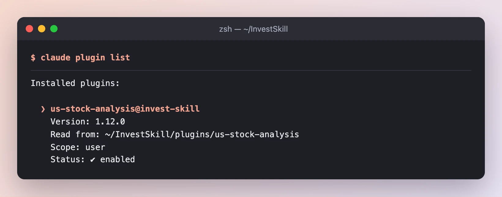

*`us-stock-analysis` version 1.12.0 is installed and enabled. All 34 skills are now available as `/us-stock-analysis:<skill>` commands.*

**Result:** the skills are ready. Not using Claude Code? See [Run it yourself](#run-it-yourself) for Cursor, Gemini CLI, Copilot and ChatGPT.

---

## Step 1 · Get primary-source data

An analysis is only as good as its numbers. If you ask an AI about a stock with no data, it may fill the gaps from memory, and memory goes stale. So before running any skill, we give it the facts.

The repo ships a small helper that downloads a company's **reported** figures from the SEC's free XBRL API and writes them into a "data pack":

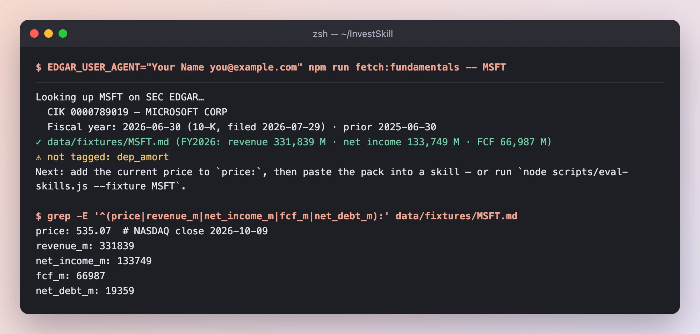

*The helper found Microsoft's 10-K for the fiscal year ending 2026-06-30 and wrote `data/fixtures/MSFT.md`. The SEC has no stock prices, so we added the latest close by hand on the `price:` line.*

**What to notice**

- **Every figure is the company's own.** Revenue $331.8B, net income $133.7B, free cash flow $67.0B — tagged by Microsoft in its filing, not estimated by anyone.
- **The helper tells you what's missing.** Depreciation (`dep_amort`) was not tagged, so the skills will have to say "unavailable" instead of guessing.
- **The SEC asks for a contact.** Set `EDGAR_USER_AGENT` to your name and email, as the SEC's fair-access policy requires.

**Result:** a single text file with FY2026 and FY2025 income statement, balance sheet, cash flow and the price. Every skill below reads only this file.

---

## Step 2 · Evaluate the stock (`stock-eval`)

`stock-eval` is the all-round starting point. It looks at financial health, valuation, quality and risk, and ends with a signal.

```text
/us-stock-analysis:stock-eval MSFT — use only the data pack at data/fixtures/MSFT.md
```

### 2a · It starts by showing its sources, then checks the data

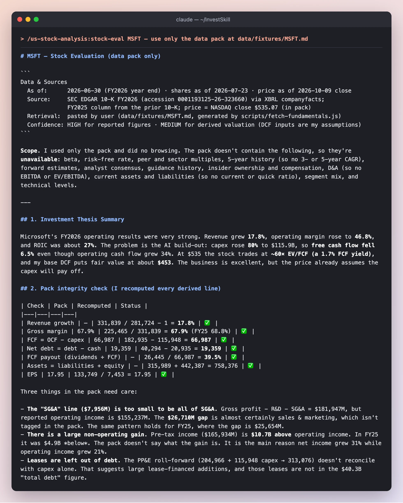

*Before any opinion, the skill states where each number came from and how far to trust it. Then it recomputes the derived lines (FCF, net debt, margins, EPS) to make sure the pack adds up.*

**What to notice**

- **The `Data & Sources` header** says the reported figures are HIGH confidence, but the valuation is only MEDIUM because the discount-rate inputs are the model's own assumptions. Every InvestSkill output starts with this header.
- **It says what it couldn't do.** No beta, no peer multiples, no analyst estimates — so no forward P/E or EV/EBITDA. It writes "unavailable" instead of inventing them.
- **It found three things worth a closer look:** an SG&A line that's too small (sales & marketing is tagged separately), a **$10.7B non-operating gain** that inflated net income growth, and leases that sit outside the debt figure.
- **The one-paragraph thesis:** an excellent business (17.8% revenue growth, 46.8% operating margin), but AI capex jumped 80% to $115.9B, so free cash flow *fell* 6.5%.

### 2b · The valuation: what is it worth?

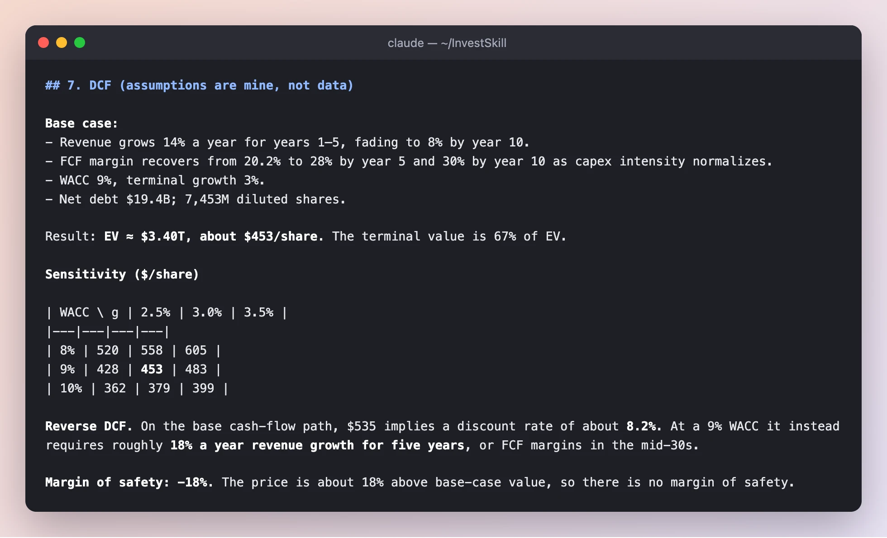

*A discounted cash flow (DCF) model. The skill marks every input as its own assumption, shows a sensitivity table, and runs the model backwards to see what today's price implies.*

**What to notice**

- **Base case: about $453 per share**, against a $535 price, so the margin of safety is **−18%**: you'd be paying more than the estimate.
- **The sensitivity table is the honest part.** Move the discount rate by one point and the value swings from $379 to $558. A DCF is a range, not a number.
- **The reverse DCF** asks the more useful question: what must be true for $535 to be fair? The answer is about **18% revenue growth a year for five years**, close to the 17.8% Microsoft just did.

### 2c · The verdict

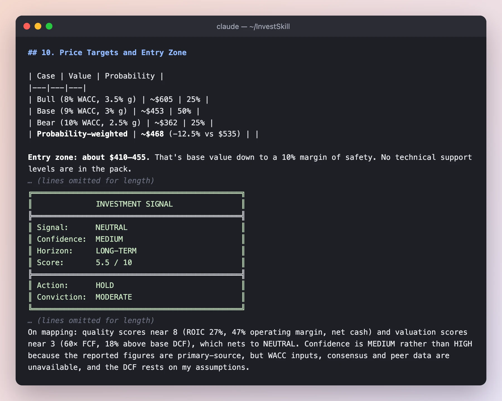

*Every InvestSkill run ends with the same box-drawn Investment Signal block, so results from different skills can be compared side by side.*

**Result of step 2:** **NEUTRAL · MEDIUM confidence · 5.5 / 10 · HOLD.** Quality scores near 8, valuation near 3, and they net to neutral: *a great company at a price that already assumes the AI spending pays off.* The skill also lists what would flip the call, for example free-cash-flow margin back above 25% (bullish) or ROIC below 22% (bearish).

---

## Step 3 · Argue the other side (`bear-case`)

A single analysis tends to agree with itself. `bear-case` is a deliberate red team: it builds the strongest possible case for **not** owning the stock.

```text
/us-stock-analysis:bear-case MSFT — use only the data pack at data/fixtures/MSFT.md
```

### 3a · The bear thesis, scored

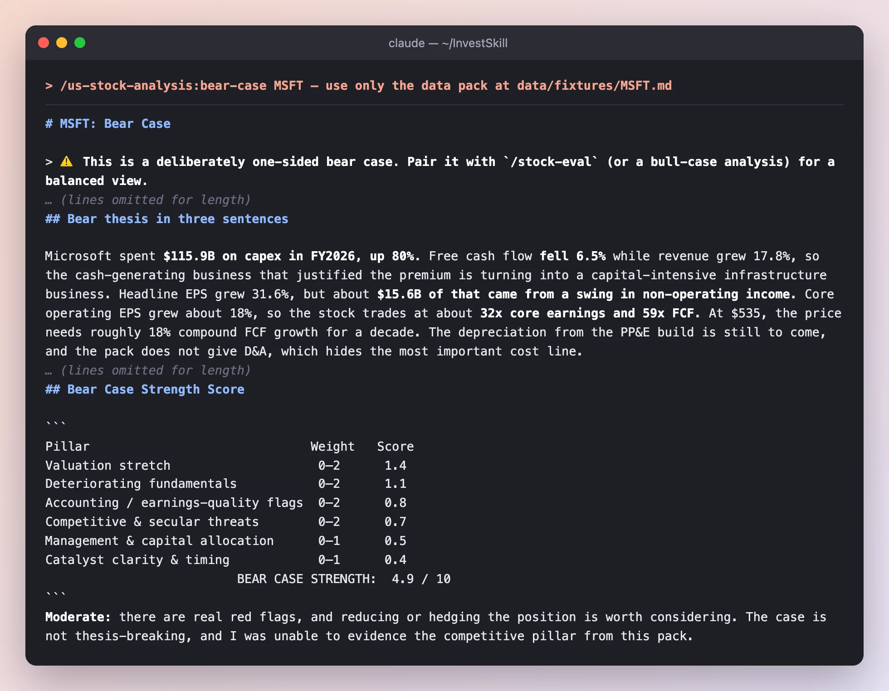

*The bear case is scored on six pillars, so you can see which arguments are strong and which are thin.*

**What to notice**

- **It goes further than step 2.** It splits EPS growth into the reported 31.6% and a **core ~18%** once the $15.6B swing in non-operating income is removed, and it measures the **incremental ROIC** on new capital at about 17%, against ~36% on average capital.
- **It admits where it is weak.** The competitive pillar scores only 0.7 / 2 because the pack has no segment or peer data. A good bear case tells you which of its arguments are guesses.
- **Strength 4.9 / 10 = "Moderate":** real red flags, but nothing that breaks the thesis.

### 3b · How far could it fall?

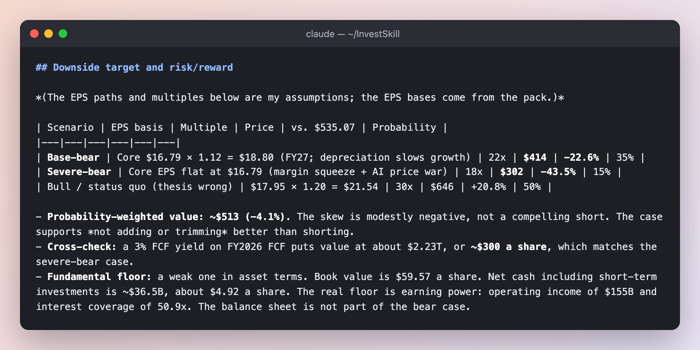

*Downside targets with explicit probabilities, including a scenario where the bear is wrong.*

**What to notice**

- **The probability-weighted value is ~$513, only about 4% below the price.** Even the bear concludes this is a reason *not to add*, not a reason to short.
- **It argues against itself.** The page ends with "thesis-killers" (what would prove the bear wrong) and concedes the strongest bull point: operating margin *expanded*.

**Result of step 3:** **NEUTRAL · 5.1 / 10 · HOLD (weak conviction).** Two skills with opposite jobs land in the same place. That agreement is more reassuring than either result alone.

---

## Step 4 · Check every number (`fact-check`)

AI models can make arithmetic slips. `fact-check` takes a finished report, pulls out every figure and claim, and checks each one against the primary source.

We saved the step 2 output as `output/msft-stock-eval.md`, then ran:

```text
/us-stock-analysis:fact-check output/msft-stock-eval.md — verify every figure against data/fixtures/MSFT.md
```

### 4a · The scorecard

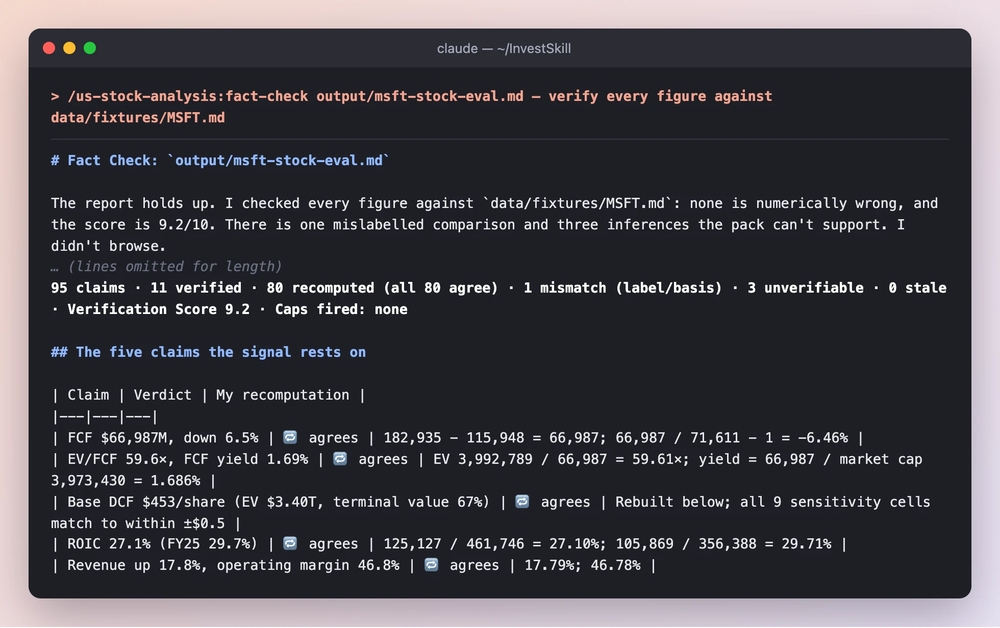

*95 claims extracted. 80 were recomputed from the raw figures and all 80 agree. It even rebuilt the DCF and matched all nine sensitivity cells to within $0.50.*

### 4b · And it caught something

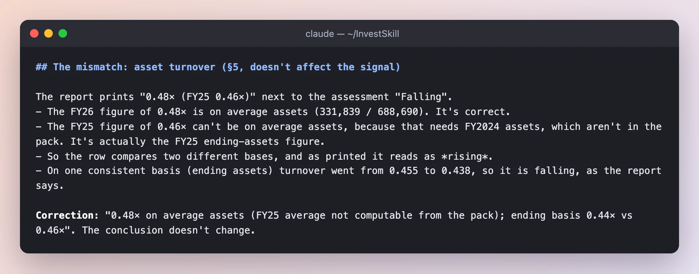

*The one mismatch: the report compared FY26 asset turnover on average assets with FY25 on year-end assets, so a falling number read as rising.*

**What to notice**

- **The catch is real and subtle.** No number was wrong, but two of them were measured on different bases. It doesn't change the signal, and the fact-check says so.
- **"Unverifiable" is not "wrong".** Three claims (for example, "the SG&A gap is almost certainly sales & marketing") are reasonable inferences the pack can't prove. They get a `[?]` tag, not a red mark.
- **Read the score correctly.** The 9.2 in this skill's signal block is a *verification* score: how trustworthy the report's numbers are. It is not a bullish rating. The signal itself (NEUTRAL / HOLD) is copied from the report, unchanged.

**Result of step 4:** **Verification Score 9.2 / 10.** The numbers behind the NEUTRAL call hold up, with one label to fix.

---

## Step 5 · Understand what you just read (`learning-coach`)

By now there are three reports full of ROIC, EV/FCF and DCF. `learning-coach` explains an output like a mentor: every metric in plain words, why it matters, what "good" looks like, and a few questions to test yourself.

```text
/us-stock-analysis:learning-coach output/msft-stock-eval.md --level beginner
```

### 5a · One card per metric

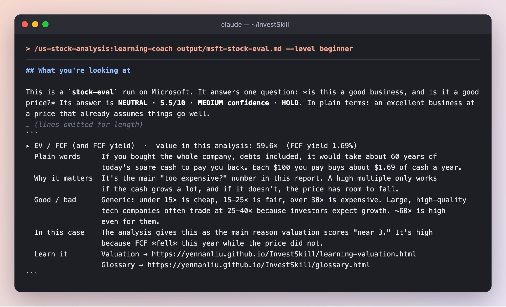

*Each metric that drove the call gets a card: plain words, why it matters, good and bad ranges, this case, and the lesson that teaches it.*

### 5b · Then it makes you think

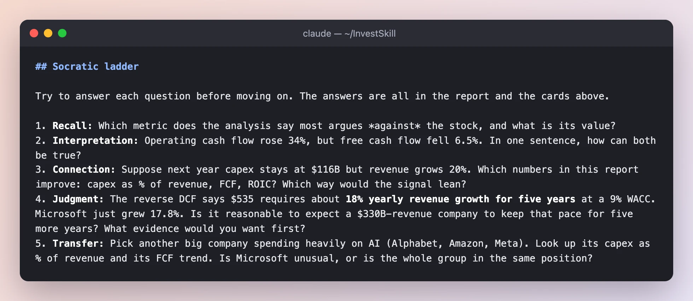

*Five questions that climb from recall to judgment. The last one asks you to apply the idea to another company.*

**What to notice**

- **"About 60 years of spare cash to pay you back"** — this is EV/FCF of 59.6× in one sentence, without jargon.
- **It points out its own date problem.** The financial figures are 103 days old, past the 90-day freshness line, so it tells you to re-run after the next quarterly report.
- **It adds understanding, not a new verdict.** The signal block is copied from `stock-eval` unchanged.
- **Want it in Chinese?** Add `--lang zh-TW`. The [繁體中文 version of this walkthrough](WALKTHROUGH-zh-TW.md) shows that run.

**Result of step 5:** you can explain *why* the answer is NEUTRAL, and you know which numbers to watch.

---

## What we ended up with

| Skill | Signal | Score | One-line takeaway |
|-------|--------|-------|-------------------|
| `stock-eval` | NEUTRAL · HOLD | 5.5 / 10 | Elite business; the price already assumes the AI capex pays off |
| `bear-case` | NEUTRAL · HOLD | 5.1 / 10 (bear strength 4.9) | Real concerns about FCF and earnings quality, but not a short |
| `fact-check` | (copied) NEUTRAL · HOLD | Verification 9.2 / 10 | The numbers hold; one mixed-basis comparison |
| `learning-coach` | (copied) NEUTRAL · HOLD | — | Watch FCF margin, ROIC and capex ÷ revenue |

**Five things this run shows about using AI for stock research**

1. **Give it data first.** With the SEC pack, every skill could say exactly where a number came from, and said "unavailable" instead of guessing when the pack was silent.
2. **One skill is one opinion.** `stock-eval` and `bear-case` have opposite jobs. Because they still agreed, the NEUTRAL call is more convincing.
3. **Check the arithmetic.** `fact-check` recomputed 80 numbers and still found a mismatch a human reader would likely miss.
4. **Every call comes with its own exit conditions.** Each output lists the triggers that would flip it, so you know what to watch instead of re-reading the whole report.
5. **Understand it before you act.** `learning-coach` turns a report into something you can explain, and it asks the questions you should be able to answer.

---

## Run it yourself

**Claude Code** — after Step 0, in a clone of the repo:

```bash
# 1. Build a data pack from the SEC (no API key needed)
export EDGAR_USER_AGENT="Your Name you@example.com"
npm run fetch:fundamentals -- MSFT
# then add today's price on the `price:` line of data/fixtures/MSFT.md

# 2–5. Inside Claude Code
/us-stock-analysis:stock-eval MSFT — use only the data pack at data/fixtures/MSFT.md
/us-stock-analysis:bear-case MSFT — use only the data pack at data/fixtures/MSFT.md
/us-stock-analysis:fact-check output/msft-stock-eval.md — verify every figure against data/fixtures/MSFT.md
/us-stock-analysis:learning-coach output/msft-stock-eval.md --level beginner
```

To reproduce the exact conditions of this page (skills can read files but cannot browse), run headless: `claude -p "<command>" --allowedTools Read`.

**Cursor, Gemini CLI, GitHub Copilot, ChatGPT** — every skill also exists as a plain prompt in [`prompts/`](https://github.com/yennanliu/InvestSkill/tree/main/prompts). Paste `prompts/stock-eval.md`, then paste the data pack, then ask "Evaluate MSFT using only this data." Or install for your agent in one line with the [install script](cookbook.html).

**Next:** [Choose a Skill](choose-a-skill.html) maps 30 frameworks to goals, and the [Cookbook](cookbook.html) has more recipes.

---

## Full outputs

These are the complete, unedited outputs from the runs above, in case you want to check that the screenshots weren't cherry-picked.

<details>
<summary><strong>Step 2 — <code>stock-eval</code> full output</strong></summary>

~~~~text
# MSFT — Stock Evaluation (data pack only)

```
Data & Sources
  As of:      2026-06-30 (FY2026 year end) · shares as of 2026-07-23 · price as of 2026-10-09 close
  Source:     SEC EDGAR 10-K FY2026 (accession 0001193125-26-323660) via XBRL companyfacts;
              FY2025 column from the prior 10-K; price = NASDAQ close $535.07 (in pack)
  Retrieval:  pasted by user (data/fixtures/MSFT.md, generated by scripts/fetch-fundamentals.js)
  Confidence: HIGH for reported figures · MEDIUM for derived valuation (DCF inputs are my assumptions)
```

**Scope.** I used only the pack and did no browsing. The pack doesn't contain the following, so they're **unavailable**: beta, risk-free rate, peer and sector multiples, 5-year history (so no 3- or 5-year CAGR), forward estimates, analyst consensus, guidance history, insider ownership and compensation, D&A (so no EBITDA or EV/EBITDA), current assets and liabilities (so no current or quick ratio), segment mix, and technical levels.

---

## 1. Investment Thesis Summary

Microsoft's FY2026 operating results were very strong. Revenue grew **17.8%**, operating margin rose to **46.8%**, and ROIC was about **27%**. The problem is the AI build-out: capex rose **80%** to $115.9B, so **free cash flow fell 6.5%** even though operating cash flow grew 34%. At $535 the stock trades at **~60× EV/FCF (a 1.7% FCF yield)**, and my base DCF puts fair value at about **$453**. The business is excellent, but the price already assumes the capex will pay off.

## 2. Pack integrity check (I recomputed every derived line)

| Check | Pack | Recomputed | Status |
|---|---|---|---|
| Revenue growth | — | 331,839 / 281,724 − 1 = **17.8%** | ✅ |
| Gross margin | 67.9% | 225,465 / 331,839 = **67.9%** (FY25 68.8%) | ✅ |
| FCF = OCF − capex | 66,987 | 182,935 − 115,948 = **66,987** | ✅ |
| Net debt = debt − cash | 19,359 | 40,294 − 20,935 = **19,359** | ✅ |
| FCF payout (dividends ÷ FCF) | — | 26,445 / 66,987 = **39.5%** | ✅ |
| Assets = liabilities + equity | — | 315,989 + 442,387 = 758,376 | ✅ |
| EPS | 17.95 | 133,749 / 7,453 = 17.95 | ✅ |

Three things in the pack need care:

- **The "SG&A" line ($7,956M) is too small to be all of SG&A.** Gross profit − R&D − SG&A = $181,947M, but reported operating income is $155,237M. The **$26,710M gap** is almost certainly sales & marketing, which isn't tagged in the pack. The same pattern holds for FY25, where the gap is $25,654M.
- **There is a large non-operating gain.** Pre-tax income ($165,934M) is **$10.7B above** operating income. In FY25 it was $4.9B *below*. The pack doesn't say what the gain is. It is the main reason net income grew 31% while operating income grew 21%.
- **Leases are left out of debt.** The PP&E roll-forward (204,966 + 115,948 capex → 313,076) doesn't reconcile with capex alone. That suggests large lease-financed additions, and those leases are not in the $40.3B "total debt" figure.

## 3. Financial Health

| Metric | FY2026 | FY2025 | Δ |
|---|---|---|---|
| Revenue ($M) | 331,839 | 281,724 | +17.8% |
| Operating income | 155,237 | 128,528 | +20.8% |
| Net income | 133,749 | 101,832 | +31.3% |
| Gross / operating / net margin | 67.9% / 46.8% / 40.3% | 68.8% / 45.6% / 36.1% | −0.9 / +1.2 / +4.2 pp |
| Operating cash flow | 182,935 | 136,162 | +34.4% |
| Capex | 115,948 (34.9% of revenue) | 64,551 (22.9%) | **+79.6%** |
| **FCF** | **66,987** (20.2% margin) | **71,611** (25.4%) | **−6.5%** |
| SBC | 12,405 | 11,974 | +3.6% |
| Cash + short-term investments | 76,843 | 94,565 | −18.7% |
| Total debt (excluding leases) | 40,294 | 43,151 | −6.6% |
| Net debt (cash only) / net cash incl. STI | 19,359 / **(36,549) net cash** | 12,909 / (51,414) | |

**Operating leverage is positive.**
- For every extra dollar of revenue, 53.3% became extra operating income (+$26.7B on +$50.1B).
- The degree of operating leverage was 1.17×.
- Total opex grew 7.4% against 17.8% revenue growth.
- **Gross margin fell, though.** Cost of revenue grew 21.1%, which looks like infrastructure cost coming through.

**Working capital** (FY26 vs FY25):

| Metric | FY2026 | FY2025 |
|---|---|---|
| DSO | 89.0 days | 90.6 days |
| DIO | 4.8 days | 3.9 days |
| DPO | 145.5 days | 115.2 days |
| CCC | **−51.7 days** | −20.7 days |

The jump in DPO is probably capex-related payables, so the improvement in CCC overstates operating efficiency.

## 4. Valuation Metrics (price $535.07; market cap ≈ **$3.97T** on 7,426M shares; EV ≈ **$3.99T**)

| Metric | Current | 1-Yr Ago / 5-Yr Avg / Sector |
|---|---|---|
| P/E (TTM = FY26) | **29.8×** | Unavailable |
| P/E, excluding the non-operating gain* | **~31.9×** (normalized EPS ≈ $16.79) | Unavailable |
| P/E (forward), PEG | Unavailable (no estimates). Trailing EPS growth gives 0.94× reported, ~1.7× normalized | — |
| Price/Book | 9.0× | Unavailable |
| Price/Sales | 12.0× | Unavailable |
| EV/EBIT | 25.7× | Unavailable |
| EV/EBITDA | **Unavailable** (D&A not tagged) | — |
| EV/FCF | **59.6×** (FCF yield 1.69%; 1.37% after SBC) | Unavailable |
| Dividend yield (cash paid ÷ market cap) | ~0.67% | Unavailable |
| Payout ratio | 19.8% of net income · 39.5% of FCF · **72.7% including buybacks** | — |

\*Normalized EPS = operating income × (1 − 19.4% effective tax rate) ÷ 7,453M diluted shares.

## 5. Key Ratios and DuPont

| Ratio | Current | Assessment |
|---|---|---|
| ROE (average equity) | 34.0% | Excellent, driven by margin rather than leverage |
| ROA (average assets) | 19.4% | Excellent |
| ROIC (NOPAT ÷ (equity + debt − cash)) | **27.1%** (FY25 29.7%) | Very high, but falling as invested capital balloons |
| Debt/Equity | 0.09× | Very low (excluding leases) |
| Interest coverage (EBIT ÷ interest expense) | 50.9× | No concern |
| Asset turnover | 0.48× (FY25 0.46×, ending basis 0.44 vs 0.46) | Falling as PP&E grows 53% |
| Current / quick ratio | **Unavailable** | — |

**3-factor DuPont:** 40.3% net margin × 0.482 asset turnover × 1.75 equity multiplier = **34.0% ROE**. ROE comes from margin, which is the most durable driver.

**5-factor DuPont:** tax burden 0.806 × interest burden **1.069** × EBIT margin 0.468 × turnover 0.482 × multiplier 1.75. An interest burden above 1.0 means the non-operating gain is *adding* to ROE this year.

## 6. Quality Score

**Piotroski F-Score: 6 of 8 testable criteria (6–7/9; criterion 6 can't be tested).**

| # | Criterion | Result | Score |
|---|---|---|---|
| 1 | ROA > 0 | 17.6% | 1 |
| 2 | CFO > 0 | $182.9B | 1 |
| 3 | ΔROA | 17.6% vs 16.5% | 1 |
| 4 | CFO/TA > ROA | 24.1% > 17.6% | 1 |
| 5 | Long-term debt / assets falling | 4.1% vs 6.5% | 1 |
| 6 | Current ratio improving | Unavailable | — |
| 7 | No dilution | Diluted shares 7,453M vs 7,465M | 1 |
| 8 | Gross margin up | 67.9% vs 68.8% | 0 |
| 9 | Asset turnover up | 0.438 vs 0.455 | 0 |

**Earnings quality is high on accruals, weaker on FCF conversion.**
- Accruals ratio is **−7.1%**.
- Cash conversion (OCF ÷ net income) is **1.37×**.
- FCF ÷ net income is only **0.50×**.
- About $10.7B of pre-tax income is non-operating and unexplained in the pack, so treat reported EPS growth of 31.6% as overstating the underlying ~18%.

**ROIC vs WACC:** WACC can't be computed from the pack (beta and risk-free rate are unavailable). Even so, ROIC of 27% exceeds any plausible large-cap WACC (8–10%, my assumption) by more than 1,700bp, so **value creation is clear.** The trend is down, from 29.7% to 27.1%.

## 7. DCF (assumptions are mine, not data)

**Base case:**
- Revenue grows 14% a year for years 1–5, fading to 8% by year 10.
- FCF margin recovers from 20.2% to 28% by year 5 and 30% by year 10 as capex intensity normalizes.
- WACC 9%, terminal growth 3%.
- Net debt $19.4B; 7,453M diluted shares.

Result: **EV ≈ $3.40T, about $453/share.** The terminal value is 67% of EV.

**Sensitivity ($/share)**

| WACC \ g | 2.5% | 3.0% | 3.5% |
|---|---|---|---|
| 8% | 520 | 558 | 605 |
| 9% | 428 | **453** | 483 |
| 10% | 362 | 379 | 399 |

**Reverse DCF.** On the base cash-flow path, $535 implies a discount rate of about **8.2%**. At a 9% WACC it instead requires roughly **18% a year revenue growth for five years**, or FCF margins in the mid-30s.

**Margin of safety: −18%.** The price is about 18% above base-case value, so there is no margin of safety.

## 8. Management, Consensus, Guidance

- **Capital allocation.**
  - Returned $48.7B (dividends $26.4B + buybacks $22.3B), which is 73% of FCF.
  - The diluted share count fell 0.2%, so buybacks are mostly offsetting SBC ($12.4B).
  - The very large capex commitment is the defining allocation decision. Its return is not yet visible: ROIC is falling and asset turnover is falling.
- **Guidance accuracy, insider ownership, compensation, say-on-pay:** unavailable.
- **Analyst ratings, price targets, estimate revisions, revision momentum (ERM):** unavailable.

## 9. Key Risks

1. **The capex payoff may not arrive.** Capex is 35% of revenue. If AI demand doesn't fill the $108B of new PP&E, ROIC keeps falling, FCF stays near $67B, and a 60× FCF multiple has room to compress.
2. **Gross margin erosion.** Cost of revenue is growing faster than revenue. Once D&A from FY26's capex fully hits the P&L, operating margin could reverse.
3. **Earnings quality and hidden obligations.** A $10.7B swing in non-operating income flatters EPS, and leases are excluded from the debt figure. True leverage and normalized earnings are both worse than the headline numbers.

**Risk matrix in brief:**
- Financial risk is **LOW**: net debt is 0.12× EBIT, and there is net cash including short-term investments.
- Valuation risk is **HIGH**: a 10% EPS miss at a constant 30× multiple is about −$54/share, and a re-rate to 25× is about −16%.
- Interest-rate sensitivity is high because of long duration: the terminal value is 67% of EV.
- Regulatory and antitrust exposure is unassessable from the pack.

## 10. Price Targets and Entry Zone

| Case | Value | Probability |
|---|---|---|
| Bull (8% WACC, 3.5% g) | ~$605 | 25% |
| Base (9% WACC, 3% g) | ~$453 | 50% |
| Bear (10% WACC, 2.5% g) | ~$362 | 25% |
| **Probability-weighted** | **~$468** (−12.5% vs $535) | |

**Entry zone: about $410–455.** That's base value down to a 10% margin of safety. No technical support levels are in the pack.

## Thesis Invalidation

The signal is NEUTRAL, so this lists what would push it either way.

**Turns BULLISH if:**
- FCF margin recovers to ≥25% (FCF ≥ ~$85B) with revenue growth still ≥15%, which would show capex intensity normalizing.
- Price falls to ≤$455 (the base DCF value) with ROIC holding ≥25%.

**Turns BEARISH if:**
- Capex ÷ revenue stays above 35% for another year while revenue growth slows below 12%.
- Gross margin falls below 65%, or ROIC falls below 22%.
- The FY26 non-operating gain proves non-recurring and FY27 EPS growth falls below 10%.

**Re-run this analysis when:**
- [ ] Next earnings release (Q1 FY2027)
- [ ] Price moves ±15% from $535 (≤$455 or ≥$615)
- [ ] 60 days have elapsed
- [ ] Material news event (acquisition, leadership change, regulatory decision)
- [ ] Next 10-K or a refreshed pack: regenerate `data/fixtures/MSFT.md`

```
╔══════════════════════════════════════════════╗
║              INVESTMENT SIGNAL               ║
╠══════════════════════════════════════════════╣
║ Signal:      NEUTRAL                         ║
║ Confidence:  MEDIUM                          ║
║ Horizon:     LONG-TERM                       ║
║ Score:       5.5 / 10                        ║
╠══════════════════════════════════════════════╣
║ Action:      HOLD                            ║
║ Conviction:  MODERATE                        ║
╚══════════════════════════════════════════════╝
```

Score Guide: 8.0–10.0 Strongly Bullish | 6.0–7.9 Moderately Bullish | 4.0–5.9 Neutral | 2.0–3.9 Moderately Bearish | 0.0–1.9 Strongly Bearish
Confidence: HIGH (strong data, clear signals) | MEDIUM (mixed signals) | LOW (limited data, conflicting signals)
Horizon: SHORT-TERM (1 week–3 months) | MEDIUM-TERM (3 months–1 year) | LONG-TERM (1+ years)

On mapping: quality scores near 8 (ROIC 27%, 47% operating margin, net cash) and valuation scores near 3 (60× FCF, 18% above base DCF), which nets to NEUTRAL. Confidence is MEDIUM rather than HIGH because the reported figures are primary-source, but WACC inputs, consensus and peer data are unavailable, and the DCF rests on my assumptions.

**Disclaimer:** Educational analysis only. Not financial advice.
~~~~

</details>

<details>
<summary><strong>Step 3 — <code>bear-case</code> full output</strong></summary>

~~~~text
# MSFT: Bear Case

> ⚠️ **This is a deliberately one-sided bear case. Pair it with `/stock-eval` (or a bull-case analysis) for a balanced view.**

```
Data & Sources
  As of:      Fundamentals 2026-06-30 (FY2026 fiscal year end) · shares 2026-07-23 · price 2026-10-09 close ($535.07)
  Source:     SEC EDGAR 10-K FY2026 (accession 0001193125-26-323660), XBRL companyfacts; FY2025 from prior 10-K · price as stated in the pack (NASDAQ close)
  Retrieval:  pasted by user (data/fixtures/MSFT.md, generated 2026-10-10)
  Confidence: HIGH for reported figures · MEDIUM overall (no history, peer, segment, D&A, lease or consensus data in the pack)
```

**Not in the pack, so not used here:** five-year multiple history, peer multiples, segment revenue (Azure, Office, etc.), D&A, finance-lease obligations, the breakdown of non-operating income, consensus estimates, the next earnings date, insider activity and short interest. Wherever one of these would matter, I say it is unavailable.

---

## Bear thesis in three sentences

Microsoft spent **$115.9B on capex in FY2026, up 80%.** Free cash flow **fell 6.5%** while revenue grew 17.8%, so the cash-generating business that justified the premium is turning into a capital-intensive infrastructure business. Headline EPS grew 31.6%, but about **$15.6B of that came from a swing in non-operating income**. Core operating EPS grew about 18%, so the stock trades at about **32x core earnings and 59x FCF**. At $535, the price needs roughly 18% compound FCF growth for a decade. The depreciation from the PP&E build is still to come, and the pack does not give D&A, which hides the most important cost line.

---

## Bear Case Strength Score

```
Pillar                              Weight   Score
Valuation stretch                    0–2      1.4
Deteriorating fundamentals           0–2      1.1
Accounting / earnings-quality flags  0–2      0.8
Competitive & secular threats        0–2      0.7
Management & capital allocation      0–1      0.5
Catalyst clarity & timing            0–1      0.4
                          BEAR CASE STRENGTH:  4.9 / 10
```
**Moderate:** there are real red flags, and reducing or hedging the position is worth considering. The case is not thesis-breaking, and I was unable to evidence the competitive pillar from this pack.

---

## Detailed findings

### 1. Valuation stretch: severity HIGH (1.4/2)

| Metric (price $535.07, 7,426M shares) | Value |
|---|---|
| Market cap | **$3.97T** ($3,973,430M) |
| EV (mkt cap + pack net debt $19,359M) | $3.99T |
| P/E (reported diluted EPS $17.95) | **29.8x** |
| P/E on core EPS (ex non-operating, ~$16.79) | **~31.9x** |
| P/S / EV/Sales | 12.0x / 12.0x |
| EV/EBIT | 25.7x |
| P/FCF (FCF $66,987M) | **59.3x** (FCF yield 1.69%) |
| P/(FCF − SBC) | 72.8x |
| P/B (book $59.57/share) | 9.0x |
| Dividend yield / buyback yield | 0.67% / 0.56% |

- **History and peers:** unavailable. The pack has no five-year range or peer set, so I can't say how many turns MSFT trades above its own history.
- **Reverse DCF** (my assumptions: 9% discount rate, 20x terminal FCF multiple, 10-year horizon). Today's $3.97T needs **FCF to compound at about 18% a year for 10 years** from the FY2026 base of $67.0B. At 15% the result is about $3.20T, roughly 20% below the current price. That growth rate matches this year's revenue growth, and it has to hold while capex already takes 63% of operating cash flow.
- **PEG:** about 1.7x on core EPS growth of ~18.4% (31.9 ÷ 18.4). That's not extreme. The weak point is the 59x FCF multiple, not the P/E.

### 2. Deteriorating fundamentals: severity MEDIUM (1.1/2)

| | FY2026 | FY2025 | Change |
|---|---|---|---|
| Revenue | $331,839M | $281,724M | **+17.8%** |
| Cost of revenue | $106,374M | $87,831M | **+21.1%** |
| Gross margin | 67.9% | 68.8% | **−0.9 pt** |
| Operating margin | 46.8% | 45.6% | +1.2 pt |
| Capex | $115,948M | $64,551M | **+79.6%** |
| Capex / revenue | 34.9% | 22.9% | +12.0 pt |
| Capex / OCF | 63.4% | 47.4% | +16.0 pt |
| Free cash flow | $66,987M | $71,611M | **−6.5%** |
| FCF margin | 20.2% | 25.4% | −5.2 pt |
| FCF / net income | 50.1% | 70.3% | −20 pt |
| Revenue / net PP&E | 1.06x | 1.37x | asset-heavier |

- **Gross margin is falling.** Cost of revenue grew faster than revenue. Operating margin rose only because R&D (+9.5%) and SG&A (+10.1%) grew at about half the rate of revenue. That kind of operating leverage runs out.
- **Depreciation is still ahead.** This is a hypothesis, because D&A is not tagged in the pack. Net PP&E jumped 53%, from $205.0B to $313.1B. Assets put into service in FY2026 will depreciate through cost of revenue in FY2027–FY2030, so gross-margin pressure is more likely to grow than to fade.
- **Returns on incremental capital are falling.** NOPAT (19.4% tax rate) rose about $19.3B on about $113.8B of new invested capital (equity + debt − cash − short-term investments). That's an **incremental ROIC of ~17%**, against ~36% on average capital. It is probably still above WACC, but WACC is not in the pack. The trend is the bear point.
- **Liquidity has thinned.** Cash plus short-term investments fell from $94.6B to $76.8B. The current portion of debt tripled, from $3.0B to $9.2B.

### 3. Accounting and earnings quality: severity LOW-MEDIUM (0.8/2)

- **Non-operating income inflated EPS growth.** Pre-tax income ($165,934M) exceeded operating income ($155,237M) by **+$10.7B** in FY2026. In FY2025 it fell short by **−$4.9B**. That **$15.6B swing is ~37% of the pre-tax income increase**. Without it, EPS is about **$16.79**, and core growth is **~18%, not the reported 31.6%**. The pack doesn't break down what drove it (investment gains, equity-method results, FX), so I can't tell whether it will recur. The tax rate also rose, from 17.6% to 19.4%.
- **Payables stretched.** Accounts payable rose 53% (+$14.7B), equal to **~31% of the $46.8B increase in operating cash flow**. If part of that is capex-related payables, cash capex understates the economic build. The breakdown is unavailable.
- **About $33B of cash outflows are not itemized.** OCF − capex − dividends − buybacks = +$18.3B. Total debt fell $2.9B, so cash plus short-term investments should have risen by about $15.4B. Instead they fell by $17.7B. The pack doesn't show where the difference went (acquisitions, investments, lease principal, tax withholding on SBC).
- **Leases are left out of debt.** The pack's $40.3B total debt excludes leases unless they are tagged as debt. For a company building datacenters, lease obligations could be material. The figure is unavailable.
- **Buybacks mostly offset SBC.** $22.3B of repurchases cut diluted shares by only 0.16% (7,465M to 7,453M). SBC was $12.4B, about 18.5% of FCF.
- **Not red flags (concessions):** DSO *improved*, from 90.6 to 89.0 days. Inventory is immaterial at 4.8 days. The pack shows no restatements or auditor issues.

### 4. Competitive and secular threats: severity LOW-MEDIUM, under-evidenced (0.7/2)

The pack has no segment, customer or peer data, so this pillar rests mostly on hypothesis:
- **Hypothesis: an AI infrastructure arms race.** The capex surge suggests rivals are forcing a spending pace Microsoft can't skip. If AI compute pricing commoditizes, the $313B asset base earns utility-like returns. The falling gross margin and incremental ROIC fit this story but don't prove it.
- Regulatory and antitrust exposure, customer concentration and AI-partner economics are **unavailable from the pack**.

### 5. Management and capital allocation: severity MEDIUM (0.5/1)

- Management chose to nearly double capex in one year at a cost to FCF. The bet may pay off, but **shareholders are bearing build risk at a 1.7% FCF yield**.
- Dividends plus buybacks ($48.7B) took **72.7% of FCF**. FCF payout on dividends alone is 39.5%. Cash returns to shareholders now compete with capex, and liquid assets are falling.
- Insider activity and governance are unavailable from the pack.

### 6. Downside catalysts and timeline (0.4/1)

| Window | Trigger | Likely magnitude |
|---|---|---|
| Near-term (0–3 mo) | Q1 FY2027 report. The quarter ended 2026-09-30, so the report is probably near; the exact date is not in the pack. A gross-margin step-down from depreciation, or capex guided up again | −5% to −10% |
| 6–18 mo | FY2027 FCF falls again despite double-digit revenue growth; non-operating gains don't repeat | De-rating toward 22–25x core EPS |
| Structural | AI compute pricing commoditizes, so incremental ROIC converges toward WACC | Multiple re-bases toward 18–20x |

Catalyst clarity is weak because there are no event dates or consensus figures to measure a "miss" against.

---

## Downside target and risk/reward

*(The EPS paths and multiples below are my assumptions; the EPS bases come from the pack.)*

| Scenario | EPS basis | Multiple | Price | vs. $535.07 | Probability |
|---|---|---|---|---|---|
| **Base-bear** | Core $16.79 × 1.12 = $18.80 (FY27; depreciation slows growth) | 22x | **$414** | **−22.6%** | 35% |
| **Severe-bear** | Core EPS flat at $16.79 (margin squeeze + AI price war) | 18x | **$302** | **−43.5%** | 15% |
| Bull / status quo (thesis wrong) | $17.95 × 1.20 = $21.54 | 30x | $646 | +20.8% | 50% |

- **Probability-weighted value: ~$513 (−4.1%).** The skew is modestly negative, not a compelling short. The case supports *not adding or trimming* better than shorting.
- **Cross-check:** a 3% FCF yield on FY2026 FCF puts value at about $2.23T, or **~$300 a share**, which matches the severe-bear case.
- **Fundamental floor:** a weak one in asset terms. Book value is $59.57 a share. Net cash including short-term investments is ~$36.5B, about $4.92 a share. The real floor is earning power: operating income of $155B and interest coverage of 50.9x. The balance sheet is not part of the bear case.

---

## Thesis-killers: what would prove the bear wrong

1. **FCF recovers in FY2027** while revenue grows ≥15%. That would show the capex is generating revenue, not just keeping pace.
2. **Gross margin holds at or above ~68%** even as the larger PP&E base depreciates.
3. **Capex intensity falls** below ~30% of revenue with no slowdown in growth.
4. **The non-operating gains turn out to be recurring**, or core operating EPS growth itself re-accelerates above 20%.
5. **Incremental ROIC rises back toward 30%+.**

**The strongest bull counterargument, which I partly concede:** operating income grew 20.8%, operating margin *expanded* to 46.8%, net cash is still positive including short-term investments, and DSO is clean. This is a high-quality company that is investing heavily, not one that is deteriorating. The bear still holds that the *price* assumes the investment succeeds. **Biggest risk to being short:** a mega-cap with $155B of operating income and a fortress balance sheet has no squeeze-free path down. Short interest is unavailable from the pack; see `/short-interest`.

---

## Thesis invalidation

**If signal is BULLISH, the thesis breaks if:**
- Fundamentals deteriorate: gross margin falls below 67%, revenue growth drops below 12%, or guidance is cut
- FY2027 FCF falls below $60B, or capex goes above 40% of revenue

**If signal is BEARISH (the direction of this analysis), the thesis breaks if:**
- Revenue growth re-accelerates above 18% while gross margin holds at or above 68% and guidance is raised
- A thesis-killer fires: FCF returns to growth, capex intensity falls, or incremental ROIC recovers
- The stock de-rates toward ~$414 (22x core EPS) without the fundamentals breaking, which would mean the downside is already priced in

**Re-run this analysis when:**
- [ ] Next earnings release (Q1 FY2027)
- [ ] Price moves ±15% from $535.07 (below ~$455 or above ~$615)
- [ ] 60 days have elapsed
- [ ] Material news event (acquisition, leadership change, regulatory decision)

```
╔══════════════════════════════════════════════╗
║              INVESTMENT SIGNAL               ║
╠══════════════════════════════════════════════╣
║ Signal:      NEUTRAL                         ║
║ Confidence:  MEDIUM                          ║
║ Horizon:     MEDIUM-TERM                     ║
║ Score:       5.1 / 10                        ║
╠══════════════════════════════════════════════╣
║ Action:      HOLD                            ║
║ Conviction:  WEAK                            ║
╚══════════════════════════════════════════════╝
```

Score Guide: 8.0–10.0 Strongly Bullish | 6.0–7.9 Moderately Bullish | 4.0–5.9 Neutral | 2.0–3.9 Moderately Bearish | 0.0–1.9 Strongly Bearish
Confidence: HIGH (strong data, clear signals) | MEDIUM (mixed signals) | LOW (limited data, conflicting signals)
Horizon: SHORT-TERM (1 week–3 months) | MEDIUM-TERM (3 months–1 year) | LONG-TERM (1+ years)

**Note:** The Score uses the standard bullish scale, so cross-skill comparisons work. It is 10 − 4.9, the Bear Case Strength. A moderate bear case (4.9/10) maps to NEUTRAL / HOLD. The bear found real valuation and cash-conversion concerns but did not show impairment. Because this analysis is deliberately one-sided, always pair it with `/stock-eval` before acting.

**Disclaimer:** Educational analysis only. Not financial advice.
~~~~

</details>

<details>
<summary><strong>Step 4 — <code>fact-check</code> full output</strong></summary>

~~~~text
# Fact Check: `output/msft-stock-eval.md`

The report holds up. I checked every figure against `data/fixtures/MSFT.md`: none is numerically wrong, and the score is 9.2/10. There is one mislabelled comparison and three inferences the pack can't support. I didn't browse.

I couldn't save the result to `output/msft-stock-eval.factcheck.md` or run any arithmetic scripts, because both need permissions this session doesn't have. So I did all the arithmetic by hand, and the whole fact-check is below. If you allow writes I can save it, along with a fully cited copy of the report.

```
Data & Sources
  As of:      2026-06-30 (FY2026 10-K) · shares 2026-07-23 (cover page) · price 2026-10-09 NASDAQ close
  Source:     data/fixtures/MSFT.md, SEC XBRL as reported, 10-K accession 0001193125-26-323660
              (FY2025 column from accession 0000950170-25-100235)
  Retrieval:  pasted by user (fetch-fundamentals.js pack, generated 2026-10-10). No browsing; the 10-K was not opened
  Confidence: HIGH for reported figures · MEDIUM for the price (user-supplied, not independently checked)
```

Every claim was checked against your pack. No training-data figures were used. The $535.07 close is from Friday 2026-10-09, the last trading day before today, so it isn't stale. I couldn't check it independently. Microsoft's fiscal year ends 30 June, and the report uses the correct periods throughout.

**95 claims · 11 verified · 80 recomputed (all 80 agree) · 1 mismatch (label/basis) · 3 unverifiable · 0 stale · Verification Score 9.2 · Caps fired: none**

## The five claims the signal rests on

| Claim | Verdict | My recomputation |
|---|---|---|
| FCF $66,987M, down 6.5% | 🔁 agrees | 182,935 − 115,948 = 66,987; 66,987 / 71,611 − 1 = −6.46% |
| EV/FCF 59.6×, FCF yield 1.69% | 🔁 agrees | EV 3,992,789 / 66,987 = 59.61×; yield = 66,987 / market cap 3,973,430 = 1.686% |
| Base DCF $453/share (EV $3.40T, terminal value 67%) | 🔁 agrees | Rebuilt below; all 9 sensitivity cells match to within ±$0.5 |
| ROIC 27.1% (FY25 29.7%) | 🔁 agrees | 125,127 / 461,746 = 27.10%; 105,869 / 356,388 = 29.71% |
| Revenue up 17.8%, operating margin 46.8% | 🔁 agrees | 17.79%; 46.78% |

## Claim ledger (condensed)

Every source is the user-supplied pack: Tier 1 data (SEC XBRL), but verification stops at the pack.

- **✅ Verified (11):**
  - The price, accession number and share date.
  - The report's list of what the pack lacks (no D&A, no current assets or liabilities, no segments, no estimates).
  - Leases are excluded from debt (pack note on line 116).
  - Revenue and diluted share counts.
  - "The non-operating gain drives net income +31% vs operating income +21%." The tax rate actually rose from 17.6% to 19.4%, so the gain is the only lift.
  - "Cost of revenue is growing faster than revenue" (21.1% vs 17.8%).
  - "ROIC and asset turnover are both falling."
  - The 5.5 score sits in the NEUTRAL band.
- **🔁 Recomputed, all agree (80):**
  - **§3:** every growth, margin and ratio figure, plus the working-capital days (DSO, DIO, DPO). The cash-conversion cycle of −51.7 days comes from rounded parts; unrounded it's −51.79.
  - **§4:** market cap $3.97T, EV $3.99T, P/E 29.8×, normalized EPS $16.79 and P/E 31.9×, PEG 0.94× / 1.73×, P/B 8.98×, P/S 11.97×, EV/EBIT 25.72×, dividend yield 0.666%, payout 19.8% / 39.5% / 72.7%.
  - **§5:** ROE 34.04%, ROA 19.42%, debt/equity 0.091×, interest coverage 50.88×, and both DuPont breakdowns.
  - **§6:** all Piotroski inputs and the 6/8 score, accruals −7.1%, OCF/NI 1.37×, FCF/NI 0.50×. ROIC beats an 8–10% WACC by 1,710bp, only just over the stated ">1,700bp".
  - **§7:** reverse-DCF rate 8.22% and margin of safety −18.1%.
  - **§8–10:** probability-weighted value $468.25 (−12.49%), entry zone (453 × 0.9 = 407.7), and the risk numbers (−$53.85 per share on a 10% EPS miss, −16.1% on a re-rate to 25×, net debt 0.125× EBIT).
- **❓ Unverifiable from the pack (3).** These are not refuted; the pack simply can't settle them.
  - The $26.7B gap between gross profit, R&D, SG&A and operating income is "almost certainly sales & marketing". The pack has no S&M line.
  - The jump in DPO (days payable) is "capex-related payables". The pack doesn't split payables.
  - The PP&E roll-forward implies lease-financed additions. Details under the consistency findings.
- **⚠️ Mismatch (1):** asset turnover, described next.

## The mismatch: asset turnover (§5, doesn't affect the signal)

The report prints "0.48× (FY25 0.46×)" next to the assessment "Falling".
- The FY26 figure of 0.48× is on average assets (331,839 / 688,690). It's correct.
- The FY25 figure of 0.46× can't be on average assets, because that needs FY2024 assets, which aren't in the pack. It's actually the FY25 ending-assets figure.
- So the row compares two different bases, and as printed it reads as *rising*.
- On one consistent basis (ending assets) turnover went from 0.455 to 0.438, so it is falling, as the report says.

**Correction:** "0.48× on average assets (FY25 average not computable from the pack); ending basis 0.44× vs 0.46×". The conclusion doesn't change.

## DCF rebuild

I assumed linear fades, since the report states the endpoints but not the path:
- **Revenue growth:** 14% a year for years 1–5, then 12.8, 11.6, 10.4, 9.2 and 8.0%.
- **FCF margin:** from 20.2% up to 28% by year 5, then up to 30% by year 10.
- **Terminal value:** Gordon growth model.

```
9% / 3.0%:  PV(Y1–10) 1,119,619 + PV(TV) 2,278,155 = EV 3,397,774 → (EV − 19,359) / 7,453 = $453.3  (TV 67.0%)
                 2.5%    3.0%    3.5%
          8%    520.1   558.4   605.3   ✓ 520 / 558 / 605
          9%    428.4   453.3   482.7   ✓ 428 / 453 / 483
         10%    361.8   378.8   398.5   ✓ 362 / 379 / 399
```

This confirms the arithmetic only. The growth, margin, WACC and terminal-growth inputs are the author's assumptions, and the report labels them that way.

## Consistency findings

- **Header:** honest. "Pasted by user", HIGH for reported figures, MEDIUM for valuation. The pack supports all of it.
- **Signal vs. score:** consistent. 5.5 is in the NEUTRAL band, matching MEDIUM confidence and HOLD.
- **Lease inference is unsupported by the pack:**
  - Beginning PP&E plus capex (320,914) is *above* ending PP&E (313,076).
  - So lease-financed additions only follow if depreciation exceeded $7.8B.
  - That's very likely for a $205B asset base, but the pack has no depreciation figure, so the evidence comes from outside it.
  - I marked it `[unsupported]`, not wrong. The 10-K's PP&E and lease notes would settle it.
- **Two share counts:** market cap uses the 7,426M cover-page count; the DCF uses the 7,453M diluted average. On 7,426M the base value is $454.9 rather than $453.3, a 0.4% difference that is within tolerance. The report could say which it uses.
- **Two ROA bases:** §5 uses 19.4% on average assets; §6 uses 17.6% on ending assets and doesn't say so. The standard Piotroski test uses beginning-of-year assets, which gives 21.6%.
- **Fabricated citations:** none.

## Corrections to the report

- **§5 asset turnover:** ~~0.48× (FY25 0.46×, ending basis 0.44 vs 0.46)~~ → **0.48× on average assets; ending basis 0.44× vs 0.46×**
- **§2 sales & marketing remark:** add `[?]`
- **§3 DPO remark:** add `[?]`
- **§2 lease sentence:** add `[unsupported from pack: no depreciation figure]`

Every other figure would just get a citation pointing at the pack section it came from.

**References:**
- [1] Pack, income statement (lines 62–80)
- [2] Pack, balance sheet (lines 82–99)
- [3] Pack, cash flow (lines 101–111)
- [4] Pack, market data: price and shares (lines 13–15 and 53–59), user-supplied
- [5] Pack, frontmatter and notes (lines 1–11 and 113–118)

The 10-K behind accession 0001193125-26-323660 was not opened in this check.

## Verification Score

| Component | Weight | Score | Why |
|---|---|---|---|
| Coverage | 30% | 10 | 91 of 95 claims (95.8%) verified or recomputed and agree |
| Signal-driving accuracy | 30% | 10 | All 5 agree exactly |
| Recomputation | 15% | 9.5 | 80 of 80 agree; one mixed-basis comparison |
| Source quality | 15% | 6 | Tier 1 data but user-supplied only; no 10-K pages or Notes opened; price unchecked |
| Freshness | 10% | 9 | Latest close and latest 10-K, but the Q1 FY2027 10-Q is due within weeks |

**Score: 9.2 / 10. Caps fired: none.** The report's inputs are sound, and its NEUTRAL / HOLD stands with the turnover label fixed.

## Thesis Invalidation

**These verdicts break if:**
- Microsoft restates FY2026 figures (a 10-K/A or 8-K).
- The pack turns out to differ from the filing. To check, run `node scripts/fetch-edgar.js MSFT --form 10-K` and spot-check revenue, operating income, OCF and capex against Item 8.
- The price moves materially. Every multiple, the reverse DCF and the margin of safety depend on $535.07.

**Re-run this check when:**
- [ ] The Q1 FY2027 10-Q is filed and the pack is regenerated
- [ ] The report is edited
- [ ] 90 days pass on the price
- [ ] Before the report is shared or used to size a position

```
╔══════════════════════════════════════════════╗
║              INVESTMENT SIGNAL               ║
╠══════════════════════════════════════════════╣
║ Signal:      NEUTRAL                         ║
║ Confidence:  MEDIUM                          ║
║ Horizon:     LONG-TERM                       ║
║ Score:       9.2 / 10                        ║
╠══════════════════════════════════════════════╣
║ Action:      HOLD                            ║
║ Conviction:  MODERATE                        ║
╚══════════════════════════════════════════════╝
```

Score Guide: 8.0–10.0 Strongly Bullish | 6.0–7.9 Moderately Bullish | 4.0–5.9 Neutral | 2.0–3.9 Moderately Bearish | 0.0–1.9 Strongly Bearish
Confidence: HIGH (strong data, clear signals) | MEDIUM (mixed signals) | LOW (limited data, conflicting signals)
Horizon: SHORT-TERM (1 week–3 months) | MEDIUM-TERM (3 months–1 year) | LONG-TERM (1+ years)

The signal is copied from the report, not re-derived. The Score is the Verification Score. A 9.2 would allow HIGH confidence, but I kept the report's own MEDIUM, because verifying the inputs doesn't make the DCF assumptions any stronger.

**Disclaimer:** Educational analysis only. Not financial advice. Verification is limited to the sources available at run time; an unverifiable claim is neither confirmed nor refuted.
~~~~

</details>

<details>
<summary><strong>Step 5 — <code>learning-coach</code> full output</strong></summary>

~~~~text
Data & Sources
  As of:      2026-06-30 (FY2026 year end) · shares as of 2026-07-23 · price as of 2026-10-09 close
  Source:     SEC EDGAR 10-K FY2026 (accession 0001193125-26-323660) via XBRL companyfacts;
              FY2025 column from the prior 10-K; price = NASDAQ close $535.07 (in pack)
  Retrieval:  pasted by user (data/fixtures/MSFT.md, generated by scripts/fetch-fundamentals.js)
  Confidence: HIGH for reported figures · MEDIUM for derived valuation (DCF inputs are my assumptions)
```

**What this header tells you:** the company's numbers come straight from Microsoft's annual filing with the SEC, so they're reliable. The valuation (the "what is it worth" part) depends on the analyst's own guesses, so trust it less.

> ⚠️ **One date is getting old.** The business figures are for the year ending **2026-06-30**, which is **103 days** before today (2026-10-11). That's past the 90-day freshness line. The price is current (Oct 9). Microsoft's next quarterly report (Q1 FY2027) should be out soon. After it lands, regenerate the pack and re-run `stock-eval` instead of relying on these figures.

---

## What you're looking at

This is a **`stock-eval`** run on Microsoft. It answers one question: *is this a good business, and is it a good price?* Its answer is **NEUTRAL · 5.5/10 · MEDIUM confidence · HOLD**. In plain terms: an excellent business at a price that already assumes things go well.

## Contract check

- ✅ **Data & Sources header**: present, with figures taken from the filing.
- ✅ **Thesis Invalidation**: present, with triggers in both directions. We'll use it at the end.
- ✅ **Investment Signal block**: present. A score of 5.5 sits inside the 4.0–5.9 Neutral band, so the score matches its label.

The analysis also checked its own arithmetic before using the numbers (Section 2). That's a good habit to copy.

---

## The five numbers that drove the call

These are ordered by how much they moved the signal, not by where they appear in the report.

```
▸ EV / FCF (and FCF yield)  ·  value in this analysis: 59.6×  (FCF yield 1.69%)
  Plain words     If you bought the whole company, debts included, it would take about 60 years of
                  today's spare cash to pay you back. Each $100 you pay buys about $1.69 of cash a year.
  Why it matters  It's the main "too expensive?" number in this report. A high multiple only works
                  if the cash grows a lot, and if it doesn't, the price has room to fall.
  Good / bad      Generic: under 15× is cheap, 15–25× is fair, over 30× is expensive. Large, high-quality
                  tech companies often trade at 25–40× because investors expect growth. ~60× is high
                  even for them.
  In this case    The analysis gives this as the main reason valuation scores "near 3." It's high
                  because FCF *fell* this year while the price did not.
  Learn it        Valuation → https://yennanliu.github.io/InvestSkill/learning-valuation.html
                  Glossary → https://yennanliu.github.io/InvestSkill/glossary.html
```

```
▸ DCF fair value & margin of safety  ·  value: ~$453/share base case vs $535 price → −18%
  Plain words     A DCF estimates every dollar the company will earn in the future, then converts it
                  into what that money is worth today. The "margin of safety" is how far below that
                  estimate you're buying.
  Why it matters  It turns "seems pricey" into a specific number you can check against.
  Good / bad      Value investors usually want a +15% to +30% margin of safety (price below value).
                  A negative margin means you're paying more than the estimate.
  In this case    The analysis estimates MSFT is worth about $453, and the price is about 18% above
                  that. The probability-weighted value is ~$468, and its suggested entry zone is $410–455.
  Learn it        Valuation → learning-valuation.html (the "price vs. value" section)
```
One formula is worth knowing here: **margin of safety = (value − price) ÷ price**. With the analysis's numbers, (453 − 535) ÷ 535 ≈ **−15%**. The report rounds this differently and calls it "−18%" ("the price is ~18% above value", which is (535 − 453) ÷ 453). Both say the same thing from different starting points. Get used to asking "percent of *what*?" whenever you see a percentage.

```
▸ Capex and free cash flow  ·  capex $115.9B (+80%, 35% of revenue) · FCF $67.0B (−6.5%)
  Plain words     Capex (capital expenditure) is money spent on long-lasting things, in this case data
                  centers for AI. Free cash flow = cash the business brings in − capex. It's the cash
                  left over for shareholders.
  Why it matters  This is the central tension. The business brought in 34% more cash, but it spent so
                  much on buildings and chips that the leftover cash went *down*.
  Good / bad      Traditional software companies spend under 10% of revenue on capex. Big cloud and AI
                  providers now spend much more, and this report's 35% is a heavy year even for them.
                  A temporarily falling FCF is fine if the spending later pays off.
  In this case    FCF = 182,935 − 115,948 = $66,987M. The analysis says "the price already
                  assumes the capex will pay off."
  Learn it        Statements → https://yennanliu.github.io/InvestSkill/learning-statements.html
```

```
▸ ROIC (return on invested capital)  ·  value: 27.1%  (down from 29.7%)
  Plain words     For every $100 tied up in the business, Microsoft earns about $27 a year after tax.
  Why it matters  If ROIC is well above the cost of money (WACC, roughly 8–10% here, which is the
                  analysis's assumption), each dollar reinvested creates value. It's the clearest
                  "is this a great business?" test.
  Good / bad      Generic: over 15% is strong and under 8% is weak. For top software/platform companies,
                  20–30%+ is normal. The *trend* matters as much as the level.
  In this case    The analysis calls it "very high, but falling" as all the new capex is added to
                  invested capital before it starts earning. One of its bearish triggers is ROIC < 22%.
  Learn it        Quality → https://yennanliu.github.io/InvestSkill/learning-quality.html
```

```
▸ Operating margin  ·  value: 46.8%  (up from 45.6%)
  Plain words     Out of every $100 of sales, about $47 is left after paying for the product, staff,
                  research, and marketing, before interest and tax.
  Why it matters  A high and rising margin means the business has pricing power and gets more efficient
                  as it grows. This number carries the "quality scores near 8" side of the call.
  Good / bad      Retail: 3–8%. Average S&P 500 company: roughly 10–15%. Strong software: 25–40%.
                  Nearly 47% is elite for a company this large.
  In this case    Margin rose even with heavy spending. The analysis warns that the *gross* margin
                  slipped (68.8% → 67.9%) and that depreciation from the new data centers hasn't fully
                  shown up in costs yet.
  Learn it        Statements → learning-statements.html
```

### The rest, briefly

| Metric | Value | One-line meaning | Lesson |
|---|---|---|---|
| Revenue growth | +17.8% | Sales grew fast for a company this big | Statements |
| P/E | 29.8× (≈31.9× normalized) | You pay about $30 for each $1 of yearly profit | Valuation |
| Non-operating gain | ~$10.7B, unexplained | A one-off-looking gain made net income grow 31% vs ~18% underlying | Quality |
| Piotroski F-Score | 6 of 8 testable | Nine pass/fail health checks. It failed two: gross margin and asset turnover | Quality |
| ROE | 34.0% | Profit on shareholders' money, driven by margin rather than debt (good) | Quality |
| Debt/Equity · interest coverage | 0.09× · 50.9× | Hardly any debt. The analysis rates financial risk LOW | Statements |
| Cash conversion (OCF ÷ NI) | 1.37× | Profit is backed by real cash | Quality |
| Dividend yield · total payout | 0.67% · 73% of FCF | Most spare cash goes back to shareholders | Valuation |
| Cash conversion cycle | −51.7 days | Microsoft gets paid before it pays suppliers. The analysis warns the improvement is overstated | Statements |

**Two small things to notice:**
- ROA appears as **19.4%** in Section 5 and **17.6%** in the Piotroski table. Asset turnover also appears twice with different values (0.48 vs 0.438). These aren't errors: one uses *average* assets and the other uses *year-end* assets, and the report says so in Section 5. When the same metric shows two values, check what it was divided by.
- The report sets the leases aside from debt, so real debt is higher than $40.3B. The analysis says this itself.

---

## How the pieces connect

The analysis weighs two strong forces against each other. **Quality** (47% operating margin, 27% ROIC, net cash) argues *for* the stock and scores near 8. **Valuation** (60× free cash flow, price ~18% above the DCF estimate) argues *against* it and scores near 3. The link between them is **capex**: Microsoft is spending heavily on AI data centers, which pushed free cash flow down and ROIC lower even as the business grew. If that spending pays off, today's price is fair. If it doesn't, the price has a long way to fall. Netting the two gives 5.5, NEUTRAL: *"a great company at a price that already assumes the bet works."*

---

## Common misreadings

1. **"HOLD means I should buy and hold."** HOLD means "if you already own it, there's no strong reason to act." It isn't advice to buy, and it doesn't consider how much of your portfolio it would be. Use `position-ladder` / `portfolio-review` for that.
2. **"A great business is a great investment."** A great business is a great investment only at the right price. This whole report is a lesson in the gap between the two.
3. **"$453 is what MSFT is worth."** It's the output of the analyst's own assumptions (14% growth, 9% WACC, 3% terminal growth). Change WACC by one point and the value moves from $379 to $558 (see the sensitivity table). Also note that the "bull" and "bear" cases here only change the discount rate and terminal growth. The business outlook itself stays the same in all three.
4. **"Net income grew 31%, so the business grew 31%."** About $10.7B came from an unexplained non-operating gain. The analysis estimates underlying growth at ~18%.
5. **"Falling FCF is bad news."** Not necessarily. It fell because of investment, not because the business got weaker. Whether that's good news depends on what the investment returns, which is exactly what the Thesis Invalidation triggers watch.

---

## Socratic ladder

Try to answer each question before moving on. The answers are all in the report and the cards above.

1. **Recall:** Which metric does the analysis say most argues *against* the stock, and what is its value?
2. **Interpretation:** Operating cash flow rose 34%, but free cash flow fell 6.5%. In one sentence, how can both be true?
3. **Connection:** Suppose next year capex stays at $116B but revenue grows 20%. Which numbers in this report improve: capex as % of revenue, FCF, ROIC? Which way would the signal lean?
4. **Judgment:** The reverse DCF says $535 requires about **18% yearly revenue growth for five years** at a 9% WACC. Microsoft just grew 17.8%. Is it reasonable to expect a $330B-revenue company to keep that pace for five more years? What evidence would you want first?
5. **Transfer:** Pick another big company spending heavily on AI (Alphabet, Amazon, Meta). Look up its capex as % of revenue and its FCF trend. Is Microsoft unusual, or is the whole group in the same position?

### ➜ What would change your mind?

The analysis has already written its own triggers. You should be able to recite them:

- **Toward BULLISH:** FCF margin back to ≥25% (≈$85B FCF) with revenue growth ≥15%, **or** the price falls to ≤$455 while ROIC holds ≥25%.
- **Toward BEARISH:** capex stays above 35% of revenue while growth slows below 12%, **or** gross margin drops below 65%, **or** ROIC drops below 22%, **or** the one-off gain disappears and FY27 EPS growth falls below 10%.

**Next step:** Read the **Valuation** lesson (price vs. value, DCF, reverse DCF). Then run `stock-valuation MSFT` after the Q1 FY2027 report to check whether the growth the price assumes still looks reachable. If you want a verdict on whether this analysis is *right*, rather than an explanation of it, run `result-validator`.

---

## Thesis Invalidation

**This explanation no longer applies if:**
- The analysis is re-run and FCF yield, ROIC, or the DCF margin of safety moves into a different band. Re-run the coach on the new output.
- The Q1 FY2027 report lands. The figures here are already 103 days old.
- `result-validator` finds a data or arithmetic error in the pasted analysis.
- You move to intermediate level. Re-run with `--level intermediate` to skip the definitions and spend more time on interpretation.

**Your own reading isn't solid yet if you can't:**
- Name the three numbers that drove NEUTRAL, without looking (hint: one quality, one valuation, one that links them)
- Say what counts as a good ROIC and operating margin *for a large software/cloud company*
- State one specific, observable trigger that would flip the call

**Re-run this coach when:**
- [ ] The underlying analysis is re-run (next earnings, price move ±15%, material news)
- [ ] You finish the Valuation lesson
- [ ] You run a different skill on MSFT (e.g. `bear-case`)
- [ ] 60 days have passed. Use `--quiz Valuation` to check what stuck

## Standard Signal Output

```
╔══════════════════════════════════════════════╗
║              INVESTMENT SIGNAL               ║
╠══════════════════════════════════════════════╣
║ Signal:      NEUTRAL                         ║
║ Confidence:  MEDIUM                          ║
║ Horizon:     LONG-TERM                       ║
║ Score:       5.5 / 10                        ║
╠══════════════════════════════════════════════╣
║ Action:      HOLD                            ║
║ Conviction:  MODERATE                        ║
╚══════════════════════════════════════════════╝
```

Score Guide: 8.0–10.0 Strongly Bullish | 6.0–7.9 Moderately Bullish | 4.0–5.9 Neutral | 2.0–3.9 Moderately Bearish | 0.0–1.9 Strongly Bearish
Confidence: HIGH (strong data, clear signals) | MEDIUM (mixed signals) | LOW (limited data, conflicting signals)
Horizon: SHORT-TERM (1 week–3 months) | MEDIUM-TERM (3 months–1 year) | LONG-TERM (1+ years)

**Learning Coach note:** After this explanation you should be able to say in your own words why the analysis reached NEUTRAL, and that a recovery in **free cash flow yield** (FCF margin back to ≥25%) or a lower price would have to happen to reverse it. The box above is `stock-eval`'s conclusion, copied without changes. This explanation adds understanding, not a new verdict.

**Disclaimer:** Educational content only. Not financial advice. This skill explains an analysis; it does not endorse, verify, or update its conclusion.
~~~~

</details>

---

**Disclaimer:** Educational content only. Not financial advice. Figures are as of the dates shown and will go stale; regenerate the data pack before relying on any number.
